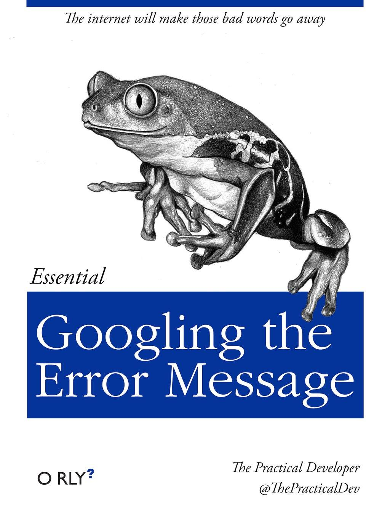

.. _tool-installation:

The command line interface
=================

Why would I want to use the command line?
---------------------------------

It is likely that the most common way you interact with your computer is via the mouse or trackpad - to do things like change into different folders, open new folders or files, delete folders or files, etc. While intuitive and simple, this mouse-mediated human-computer interaction is not always a good thing.

For example, let's imagine that you're a business owner and you have a Microsoft Word file with a list of customers and the amount they have spent at your business. If you wanted to figure out which customer had spent the most, you might: Open MS Word, click the File --> Open dropdown menu, navigate to the folder with the text file, open the file, and read through it to find the customer who had spent the most.

However, from a scientific and bioinformatic point-of-view, there are at least three fundamental problems with this mouse-driven menu-dropdown human-reading approach. First, it is error prone. In reading the text file, you might mis-read one line, and that line may be the one containing top-spending customer. Second, it is slow. Imagine if you had hundreds of files to look through (e.g. one from each week for the past five years). The job would take days. Third, it is not possible for you or anyone else to repeat the process in a precise and definite manner.

Fortunately, we do not have to do things this way. By using the command line, you can write down all the commands you use and save them (e.g. in a text file). Then, if you want to repeat the process *exactly*, you can just execute each command in this text file, in order. We will see how this might be done in a future lab.

By having such a list of commands, it is also possible to *make the computer execute them in order*, making it very feasible to perform this set of commands hundreds or thoughsands of times. Again, we will see how to do this in a future lab.

Finally, by having the computer perform **all** the commands, we can ensure that they are done correctly (e.g. that the top-spending cutomer is always found) - unless of course there is a bug in your program.

Thus, by using the command line, we have solved all of these problems: we are unlikely to have errors, the process can be automated and applied to thousands of files (:numref:`fig-100_folder`) in less than a second, and the process is easily repeated by anyone, at any time. For more inspiration, read `this <https://www.nature.com/articles/d41586-021-00263-0>`_ brief article.

.. _fig-100_folder:

   This is what the future holds.

Although it may seem that using the command line only complicates your life, you must stay positive, open-minded, and determined. As time goes on, you will begin to see that there are very significant advantages to using the command line to interact with your computer. First, then, you should become acquainted with it.

Preliminaries
---------------------------------

Note that throughout this course you may see commands or files or directories that are named something like ``my_awesome_file.tab`` or ``my_home_directory`` or ``myresults.txt``. When you see names like this in the instructions, *this does not mean that you should name your files or directories in this way*. Rather, you should replace these placeholder names with names that are **relevant to you**, or which are descriptive **for you**, or which contain **your** directory names. For example, if you are making a file that contains the results of a quality control analysis of DNA sequences from *E. coli*, you might name the file ``ecoli_qc_results.txt``.

Naming convention
~~~~~~~~~~~~~~~~~~~~~

One important aspect of organising files and directories (folders) is `naming convention <https://en.wikipedia.org/wiki/Naming_convention_(programming)>`_. When working on the command line, your life will become considerably easier if you avoid using spaces in your files and directory names. Thus, **never** name your file ``my awesome file.txt``. Instead, name it ``my_awesome_file.txt`` ("snake case"), or ``myAwesomeFile.txt`` ("camel case") or ``my-awesome-file.txt`` ("kebab case") or ``my.awesome.file.txt`` but probably not ``MY-AWESOME-FILE.txt`` ("screaming snake case"). You should pick one of these at the start of the course, and *stick to that format throughout the course* (i.e. camel case, or kebab case, etc. - see (:numref:`fig-naming`).

.. _fig-naming:

	Please be consistent with your naming.

The second thing to pay attention to when naming files is the *extension* or suffix. For example *text files* are usually named with the extension ``.txt``. MS Word files usually have the extension ``.doc`` or ``.docx``. In this course, we will run into a wide variety of files with a wide variety of extensions, for example ``.fastq``, ``.sam``, ``.bam``, ``.txt``, ``.sh``, ``.fasta``, ``.html``, ``.gbk``, ``.bai``, ``.py``, ``.r``, ``.gz``, ``.aln``, ``.tre``, ``.phy``, ``.vcf``,  ``.bcf``, and many more! Hopefully at the conclusion of this Semester you will be familiar with all of these.

While we are the topic of `naming conventions <https://en.wikipedia.org/wiki/Naming_convention_(programming)>`_, there are certain characters that you should **always** avoid when naming files and folders. Besides spaces, these are (not necessarily exhaustive):

.. code-block:: bash

   : ; ` " ' \ / ! @ # $ % ^ & * ( ) + , ? [ ] { } | > <
  

Directory structure
~~~~~~~~~~~~~~~~~~~~~~

In addition to naming conventions, there are good and bad ways to organise your files and directories. Please have a brief read through `this resource, <https://www.oreilly.com/library/view/developing-bioinformatics-computer/1565926641/ch04.html>`_

Navigating via the command line
---------------------------------

.. Attention::
   Never forget.

   There is one fundamental aspect of using the command line that you **must never forget**. It is perhaps the single most powerful method available to save time. That method is...
   

   **tab-complete**
   

   `Tab-complete <https://en.wikipedia.org/wiki/Command-line_completion>`_ can be used to auto-complete commands, directory names, and file names. If you are not sure whether your file is named ``results_QC.txt`` or ``results_qc.txt`` then on the command line you can simply type ``results`` *and then tab*, and the computer will auto-complete the name (assuming there is a file or directory or command that begins with ``results``).

   If you type the first part of a file and then press tab, but find that it does not autocomplete *even though you know you have the correct start of the file name*, then try pressing tab twice. This will give you a list of all the files (directories, commands, etc.) that begin with the first few letters that you have typed. This becomes important, for example, if you have a file named ``my_awesome_file.txt`` and ``my_awesome_file2.txt`` but you only type ``my_awes`` and then tab-complete.

In the beginning, it is likely that navigating via the comman line will not be easy for you. However, it will become easier over time. There are actually only a very small number of commands/syntaxes that you should have at your disposal. The first of these (of course!) is **tab-complete**.

.. hint::
	TAB-COMPLETE!

Directories
~~~~~~~~~~~~~~~~~~~~~~~~~~~~~~~~~
To begin then, let's figure out where we are:

Try typing ``pwd`` and then <enter>. ``pwd`` stands for "print working directory," and is the simplest way to check where you are in the directory structure. You should be sitting in your ``home`` directory. If you are not in your home directory, type ``cd`` and press <enter> (more on ``cd`` later).

You might now want to check what is in your directory. Type ``ls`` and <enter>. ``ls`` stands for "list," and will simply list the contents of your directory. ``ls`` has many associated options (i.e. ways that you can ask the information to be displayed). For example, try typing ``ls -lh``. This will list everything in your directory in long-form (``-l``) and in a human-readable format (``-h``). To see all the available options, you can type ``man ls`` ("manual").

.. hint::
		In fact, for *any* command you type, you can precede it by ``man``, and you will see a full description of what the command does and what options are available for it.

Now that you have used ``ls`` to find out what is in your directory, you might like to make a new directory (even if you don't want to add one, please pretend you do for the sake of this excercise). To do this, type ``mkdir my_awesome_dir`` and press <enter>. ``mkdir`` stands for "make directory", and will simply make a new directory with the name you write. Now check that you have successfully made this new directory (hint - try using ``ls``).

Now that you've made a new directory, perhaps you'd like to go inside this new directory? Try typing ``cd name_of_my_dir``. The ``cd`` command stands for **c**hange **d**irectory. If you type ``cd`` followed by nothing, then you will change into your ``/home`` directory.

If you type ``cd`` followed by a name, the computer will attempt to change into the directory you named. If that directory does not exist, it will spit out an error. *But you should know whether the directory you have typed exists, and that you have not spelled it incorrectly*. How, you ask? **Tab-complete!**.

If you want to change into the directory above you in the tree, type ``cd ..``. If you want to change two directories up, try ``cd ../../`` Finally, if you want to change back into the last directory you were in, you can type ``cd -``. This is handy if you are changing back and forth between two directories.

One nice way of *visualising* directory structure is using the program ``tree``. Try typing that command now. Then try changing into your home directory, and type ``tree`` again.

.. hint::
		If you know that you have typed something handy but can't remember it, or if you have typed a long and involved command but can't remember it, then using the command ``history`` will list all your most recent commands. If you know that you typed it only two or three commands before, you cN simply use the up arrow, and the commands you wrote previously will appear.

Making a new file
~~~~~~~~~~~~~~~~~~~~~~~~~~~~~~~~~
Let's make a new file inside your new directory. Move into the directory you made above (or check that you are already there), and make a new file. There are (at least) two ways to do this. First, you can use the command ``touch``.

.. code-block:: bash

   touch great_list.txt

This will make an empty file with the title *great_list.txt*. Try it. You can now put text into that file using a special operator, the redirect operator. It looks like this ``>``. If you combine that with the ``echo`` command (which simply echoes what you write), you can then write to the file.

.. code-block:: bash

   touch great_list.txt
   echo "Reasons why I'm great" > great_list.txt
   echo "This will be a long list" >> great_list.txt

Note that ``>`` will write your text to the file, while ``>>`` will *append* your text to the file.

More commonly, though, you will want to make a file that has something in it. Usually, we will use the simplistic GUI editor ``nano`` for this. Try typing ``nano`` on the command line, and this editor should open. Hopefully the layout of the editor will be self-explanatory.

Copying a file or directory
~~~~~~~~~~~~~~~~~~~~~~~~~~~~~~~~~
Sometimes you will want to copy a file or directory - perhaps to have on hand as a backup, perhaps to modify in some way, or perhaps for some other reason. The command to copy a file is ``cp``:

.. code-block:: bash

    cp myfile.txt mycopiedfile.txt

To copy a directory, you need to add an option:

.. code-block:: bash

    cp -r mydir mycopieddir
	
The ``-r`` stands for recursive, and it is an option that is used by many different commands.

Moving or renaming a file
~~~~~~~~~~~~~~~~~~~~~~~~~~~~~~~~~
Moving files and renaming files *are the same thing* on the command line. The command to move a file (or directory) is ``mv``, and the syntax to move a file into a new directory (``mynewdir``) is:

.. code-block:: bash

	mv myfile.txt mynewdir/

This assumes ``mynewdir`` exists. If, instead, you would like to rename a file, then it is simply

.. code-block:: bash

	mv myfile.txt myrenamedfile.txt

Yes, it's confusing at first.

Sometimes, you will want to move all files of a certain type, for example all the fastq files:

.. code-block:: bash

	mv *fastq mynewdir/

The asterisk is a *wildcard character*. The ``*.fastq`` will match any file that ends in ``.fastq``. We will run into the wildcard character again in the future.

Deleting a file or directory
~~~~~~~~~~~~~~~~~~~~~~~~~~~~~~~~~
Always be very careful when deleting files or directories, because they will disappear forever, rather than being placed into the Trash, which you then have to empty. To delete a file, use ``rm``:

.. code-block::bash
	rm myfile.txt

To delete a directory, use ``rmdir``:

.. code-block:: bash

	rmdir mydir

To remove directories with files or other directories contained within them, you will have to use plain old ``rm``, but specify the recursive option:

.. code-block:: bash

	rm -r mydirwithstuff

However, if you take this route, make sure there is nothing in the directory that you want, because ``rm`` is forever.

.. Attention::
		One way to protect your files and directories so that they are not inadvertantly removed is by changing the `permissions <https://en.wikipedia.org/wiki/File-system_permissions>`_ on the files. We will not go into detail into how to do this. However, if you would like to make sure you don't delete a file, you can type ``chmod 555 myfile``. To protect an entire directory and its contents, you can type ``chmod -R 555 mydir``.

Becoming a better bioinformatician
---------------------------------

Throughout this lab course, *google is your friend*. If you have errors, or if you are not sure how you might do something, or if you forget a command, google it!

Thus, **Step One** as you begin the lab is: Approach the command line with confidence and in a calm manner, assured that whatever goes wrong, you can google your way out of it (:numref:`fig-googling`).

.. _fig-googling:

	It's actually a skill that takes time to develop.

`It's <https://codeahoy.com/2016/04/30/do-experienced-programmers-use-google-frequently/>`_

`what <https://www.reddit.com/r/programming/comments/3bwo68/how_much_does_an_experienced_programmer_use_google/>`_

`all <https://www.hanselman.com/blog/am-i-really-a-developer-or-just-a-good-googler>`_

`good <https://www.freecodecamp.org/news/google-not-learn-not-why-searching-can-be-better-than-knowing-79838f7a0f06/>`_

`programmers <https://fossbytes.com/do-best-programmers-use-google-stack-overflow-time/>`_

`do <https://news.ycombinator.com/item?id=11603078>`_
