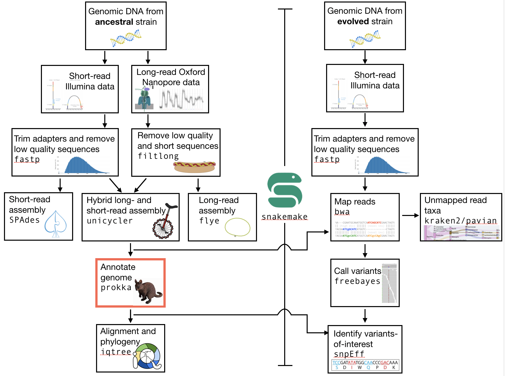

.. _ngs-annotation:

Genome annotation
=================

Preface
-------

In this section you will predict genes and assess your assembly using |prokka|, which employs several gene prediction algorithms as well as a method to search for ortholgoues, |busco|.

.. NOTE::

   You will encounter some **To-do** sections at times. Write the solutions and answers into a text-file.   

Overview
--------

The part of the workflow we will work on in this section can be viewed in :numref:`fig-workflow-anno`.

.. _fig-workflow-anno:

   The part of the workflow we will work on in this section marked in red.

Learning outcomes
-----------------

After studying this section of the tutorial you should be able to:

#. Explain how annotation completeness is assessed using orthologues
#. Use bioinformatics tools to perform gene prediction
#. Use genome-viewing software to graphically explore genome annotations and NGS data overlays 

Installing the software
-----------------------

We will use two pieces of software today, |busco| and |prokka|. Both are available on the ``bioconda`` channel, named as expected (``prokka`` and ``busco``). Go ahead and install them now. The ``prokka`` installation will take a couple of minutes.

If you would like, you can now also make a new directory for the annotation results.

Genome Annotation
---------------------------------------------

``prokka`` uses a number of methods to find open reading frames, tRNA, rRNAs, tmRNAs, and signal peptides.

The majority of the program that are used implement a hidden markov model (HMM) to infer where these elements lie in the assembly you have made. We have discussed the characteristics and use of HMMs in lecture.

``prokka`` is very simple to run, but has a very wide range of `options <https://github.com/tseemann/prokka#crazy-person>`_. Look at those now to get an idea of what information you can feed it.
Minimally, to run the program you need to give it one argument - the location of the genome assembly as a ``.fasta`` file. However, you will probably find that it is more useful to give it the location of the ``.fasta`` and an output directory (``--outdir``). A prefix for your organism may also be useful (``--prefix``). For more options, you can simply type ``prokka``:

.. code:: bash
  
      Name:
      Prokka 1.13 by Torsten Seemann <torsten.seemann@gmail.com>
      Synopsis:
        rapid bacterial genome annotation
      Usage:
        prokka [options] <contigs.fasta>
      General:
        --help            This help
        --version         Print version and exit
        --docs            Show full manual/documentation
        --citation        Print citation for referencing Prokka
        --quiet           No screen output (default OFF)
        --debug           Debug mode: keep all temporary files (default OFF)

Perform this annotation on your ``unicycler`` assembly first. The annotation will take around two minutes (depending on how many of you are running it simultaneously), so you can run it in a ``tmux`` terminal if you like.

.. Attention::

   You may find that you need to downgrade blast. If so you can downgrade it using ``conda install blast=2.2``

Next, perform your annotation on either your ``spades`` or ``flye`` assemblies. Make sure you designate a different output folder for your annotations.

Finally, **if you have time**, integrate the annotation process into your ``snakefile``. You will have to select on of the output files (``*.gbk`` is probably best) as the ``output`` file that ``Snakemake`` should look for. You input directory will have to be a ``params`` argument (e.g. ``params.dir``).

Assessment of orthologue presence and absence
---------------------------------------------

|busco| will assess orthologue presence absence using |blast|, a rapid method of finding close matches in large databases (we will discuss this in lecture).

- A fasta format input file ``-i``
- A name for the output files ``-o``
- The name of the lineage database against which we are assessing orthologue presence / absence ``-l``
- An indication of the type of annotation we are doing (proteins), ``-m``.

A high quality genome
~~~~~~~~~~~~~~~~~~~~~~

Try to use ``busco`` now for your ``unicycler`` assembly. The analysis should take less than one minute. The input file that you should use is the protein fasta file produced by ``prokka``, denoted by the extension ``.faa``. The lineage database that you should use is *bacteria_odb10*, so the argument would be ``-l bacteria_odb10``.

.. Attention::

   You may find that ``busco`` errors out. If so you can create a new ``conda`` environment and install ``busco``. Firset, deactivate your ``ngs`` environment: ``conda deactivate``. Then, create a new environment named |busco| while simultaneously installing ``busco``: ``conda create -n busco -c bioconda -c conda-forge busco=5.1.2``. This may take a couple of minutes.

The ``busco`` analysis creates a directory with a large number of files.

Navigate into the output directory you created.
There are many directories and files in there containing information on the orthologues that were found, but here we are only really interested in one: the summary statistics.
This is located in the ``short_summary*.txt`` file.

Look inside this file.
It will note the total number of orthologues found, the number expected, and the number missing.
This gives an indication of your genome completeness.

Genome completeness ToDo
~~~~~~~~~~~~~~~~~~~~~~

.. TODO::

   Note the completeness statistics for your genome. Is it necessarily true that your assembly is incomplete if it is missing some orthologues ("BUSCOs")? Why or why not?

A low quality genome
~~~~~~~~~~~~~~~~~~~~~~

Try to use ``busco`` now for your ``spades`` or ``flye`` assembly. Again, make sure you have specified a different output directory. The analysis should take less than one minute.

Genome completeness comparison ToDo
~~~~~~~~~~~~~~~~~~~~~~

.. TODO::

   Note the completeness statistics for your ``flye`` or ``spades`` genome. How does this differ from your ``unicycler`` genome? Why do you think these two differ?

Interactive viewing
-------------------

We will use the software |igv| to view the assembly, the gene predictions you have made, and the variants that you have called, all in one window. 

Installing |igv|
----------------

We will not install this software using |conda|, as IGV is GUI (graphical user interface) software and needs to be used directly on your virtual machine. We will thus need to do two things: install the IGV software, and download the relevant files from ``agnes`` onto your desktop. Download the files from ``agnes`` using ``rsync``. First, exit the ``agnes`` terminal. Then the general form of the ``rsync`` command is:

.. code:: bash

          rsync --progress loginname@123.123.123:~/my_analysis/myfile.fasta

Here, ``loginname@123.123.123`` is the login name and IP address you would usually type to ``ssh`` into agnes. The ``:`` following that indicates that you are about to specify the file, and the ``~/my_analysis/myfile.fasta`` is the path to the file, where ``~`` indicates that it is relative to your home directory. Let me know if you have trouble with this command.

You will need three files: your ``.fasta`` ``unicycler`` assembly ``.vcf`` file from the Variant calling lab, and the ``.gff`` file you have made today.

Now, make a new directory in your home directory entitled “software”, and change into this directory.
You will have to download the software from the Broad Institute:

.. code:: bash

          wget https://data.broadinstitute.org/igv/projects/downloads/2.9/IGV_Linux_2.9.4_WithJava.zip

          # unzip the software:
          unzip IGV_2.9.0.zip

          # and change into that directory.
          cd IGV_2.9.0
          
          # To run the interactive GUI, you will need to run the bash script in that directory:
          bash igv.sh

This will open up a new window.
Navigate to that window and open up your genome assembly:

- Genome -> load Genome from File
- Load your assembly, not your gff file.

Load the tracks:

- File -> Load from file
- Load your ``vcf`` file.
- Load your ``gff`` file.

  
At this point you should be able to zoom in and out to see regions in which there are SNPs or other types of variants.
In order to zoom in and out, **you will first have to click on the name of the contig** in the top panel, e.g. click on the "1" that is visible there. After that, you zoom button (top right) shoudl become active.
You can also see the predicted genes.
If you zoom in far enough, you can see the sequence (DNA and protein).

You can right click on the sequence and copy it.

If you open a new browser window you can go to the blastn homepage (google or go `here <https://blast.ncbi.nlm.nih.gov/Blast.cgi?PAGE_TYPE=BlastSearch>`_).

There, you can blast your gene of interest (GOI) and see if blast can assign a function to it.

The end goal of this lab will be for you to select a variant that you feel is interesting (e.g. due to the gene it falls near or within), and hypothesize as to why that mutation might have increased in frequency in these evolved *E. coli* populations.

.. only:: html

   .. rubric:: References

.. [SIMAO2015] Simao FA, Waterhouse RM, Ioannidis P, Kriventseva EV and Zdobnov EM. BUSCO: assessing genome assembly and annotation completeness with single-copy orthologs. `Bioinformatics, 2015, Oct 1;31(19):3210-2 <http://doi.org/10.1093/bioinformatics/btv351>`__

.. [STANKE2005] Stanke M and Morgenstern B. AUGUSTUS: a web server for gene prediction in eukaryotes that allows user-defined constraints. `Nucleic Acids Res, 2005, 33(Web Server issue): W465–W467. <https://dx.doi.org/10.1093/nar/gki458>`__
