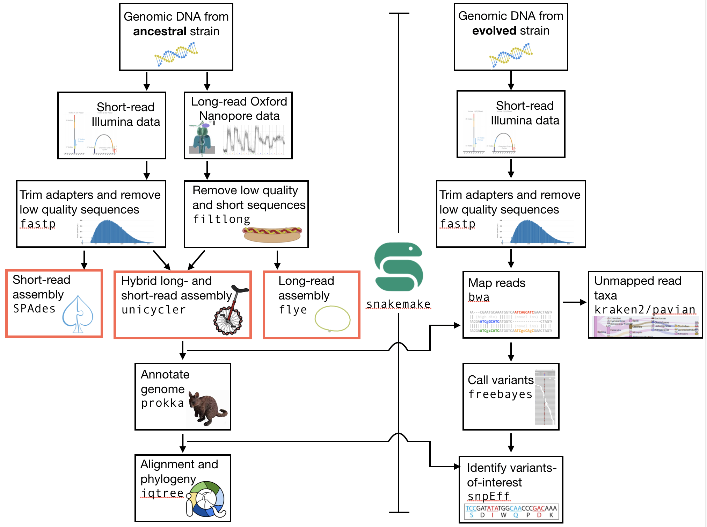

.. _ngs-assembly:

Genome assembly
===============

Preface
-------

In this section we will use our skill on the command-line interface to create a
genome assembly from sequencing data. We will constructing three types of assebmlies:
A short-read only assembly (with Illumina data); a long-read only assembly (with Oxford Nanopore data);
and a "hybrid" assembly (using both Illumina and Oxford Nanopore data).

.. NOTE::

   You will encounter some **To-do** sections at times. Write the solutions and answers into a file (MS Word, Google docs, or any text editor).

Overview
--------

The part of the workflow we will work on in this section can be viewed in :numref:`fig-workflow-assembly`.

.. _fig-workflow-assembly:

   The part of the workflow we will work on in this section marked in red.

Learning outcomes
-----------------

After studying this tutorial you should be able to:

#. Construct and interpret a whole genome assembly.
#. Discuss the relative advantages and disadvantages of using short- and long-read seqeuncing technology for genome assembly.
#. Judge the quality of a genome assembly.

Before we start
---------------

Are your directories organised and clean?

.. code:: bash

          tree -L 2

And let's make sure we have our ``conda`` environment activated:

.. code:: bash

    conda activate ngs

Subsampling reads
~~~~~~~~~~~~~~~~~

Due to the size of the short read data set, you may find that the assembly takes a lot of time for the assembly to complete, especially on older hardware.
To mitigate this problem we will randomly select a subset of sequences we are going to use at this stage of the tutorial.
To do this we will install another program, `seqtk <https://github.com/lh3/seqtk>`_. Use ``conda install`` to install this program now.

Now that you have installed ``seqtk``, you are going to sample the original reads so that you have at most 50X *coverage*. In this case, we will again estimate the bacterial genome size as 5 Mbp, meaning that 50X coverage requires a total of 250 Mbp of data. If you have less than this, you do **not** need to subsample. However, most of you will have more than this. For this reason, we will select only some of these to use for assembly. You cancheck how many Mbp of data you have right now by using the program that you installed previously, ``seqkit``. Remember that the command in ``seqkit`` that gives you a summary of your ``.fastq`` file data is ``seqkit stats``. Go ahead and remind yourself of the content of your *trimmed*  ``.fastq`` files for your ancestor dataset. Next, some  calculations:

Note that there are three arguments that we are giving to ``seqtk`` - a "seed", which determines what random subset of reads are selected (i.e. it is fed into a random number generator), a file of reads (trimmed), and the *fraction or number* of reads to maintain. The easiest is probably the fraction. In this case, you will need to calculate this number. For example, if the ``seqkit stats`` summary says that you have a total of 750 Mbp of data,andyou would like 250 Mbp, then you will need to sample 1/3 of the reads. In general the fraction you need to sample would be: ``250Mpb / total_bp``. Calculated this fraction now.

In the command below the ``-s11`` is how the seed is set. **It is critical** that the seed you set for subsampling is the same for both sets of reads. However, you are free to change the seed itself (e.g. you could use ``-s100`` for both readsets if you want. Using a different seed from your neighbour may have the interesting downstream effect of giving you slightly different genome assemblies. Anyway, onto the sampling:

.. code::

    # Subsample reads.
    # Note the redirect arrow. Without this, the reads will
    #simply be output to your terminal screen
    seqtk sample -s11 my.reads_R1.trimmed.fastq 0.2 > my.sub.reads_R1.trimmed.fastq.gz
    seqtk sample -s11 my.reads_R2.trimmed.fastq 0.2 > my.sub.reads_R2.trimmed.fastq.gz

In the commands below you need to change the input directory from ``trimmed/`` to ``sampled/``.

.. note:: The ``-s`` options **needs** to be the same value for file 1 and file 2 to samples the reads that belong to each other. It specified the seed value for the random number generator. If you have not done this, repeat the command.

.. note:: It should be noted that by reducing the amount of reads that go into the assembly, we are losing information that could otherwise be used to make the assembly. Thus, the assembly may become worse (although this is by no means certain).

tmux usage
~~~~~~~~~~~~
The assembly programs that we will use today will take some time to complete because they are solving very difficult problems. However, you will want to make sure that the programs keep running even after you have logged out of the server and quit your VM. The`tmux <https://github.com/tmux/tmux/wiki>`_ program allows exactly this - you can keep processes (i.e. softeare programs) operating in the background so that they continue running after you have logged out from a server. As noted above, *this can be extremely useful for programs that take a while to complete*. To use tmux, simply type ``tmux`` at the command prompt. This will bring you to a new screen. *If you find that tmux is not installed, go ahead and install it with conda*.

The single most important thing to remember about ``tmux`` is that to do *anything* to control the window, you must type ``<ctrl>-b`` first. If you do not do this, you will simply keep typing on the command line. There are only four basic commands to remember:

- ``<ctrl>-b`` (move into control mode)
- ``<ctrl>-b d`` (**d**etach from the current session and return to the normal command line)
- ``<ctrl>-b x`` (e**x**it from the current session *and quit it* to return to the normal command line)
- from the normal command line: ``tmux ls``. This will list all the current ``tmux`` sessions you have, by name.
- from the normal command line: ``tmux a -t session_name``. This will return you to the ``tmux`` session that you specify with ``session_name``

Once you are in your new ``tmux`` screen, you can go ahead and start running your software. 

Creating a genome assembly
--------------------------

We want to create a genome assembly for our ancestor strain.
We are *first* going to make a short-read only assembly using the subsampled quality trimmed R1 and R2 Illumina sequences. We will use a program called |spades| to build a genome assembly.

.. todo::

   #. Discuss briefly why we are using the ancestral sequences to create a
      reference genome as opposed to the evolved line.

Installing the short-read assembly software
~~~~~~~~~~~~~~~~~~~~~~~

The intallation of |spades| can be done through conda, although the program should be specificed as ``spades``. Go ahead and install the program now.

SPAdes usage
~~~~~~~~~~~~

.. code:: bash

    # first create a output directory for the assemblies
    mkdir assembly

    # to get a help for spades and an overview of the parameters type:
    spades.py -h

The two files we need to submit to |spades| are two paired-end read files. We also need to specify the output location with ``-o``. Before you continue with the assembly command, make sure you are using ``tmux``.

The command you use will be something similar to:

.. code:: bash

    spades.py -o /output_dir -1 input.R1.fastq -2 input.R2.fastq

Next go ahead and detach from the ``tmux`` session using ``<ctrl>-b d``. This should bring you back to the normal command line. You can check that your ``tmux`` session is running by typing ``tmux ls``.

Installing the long-read assembly software
~~~~~~~~~~~~~~~~~~~~~~~

We are *next* going to make a long-read only assembly using the quality filtered Oxford Nanopore reads. We will use a program called |flye| to build a long-read genome assembly. This can be installed using ``conda``. The name of the program is simply ``flye``. Go ahead and install it now.

Flye usage
~~~~~~~~~~~~
For flye we only need a single file of reads - the long Oxford Nanopore reads. We will also need to specify the *type* of reads (they could be another type of long read, such as PacBio), the estimated genome size, and the number of threads to use. Please do not use more than two threads!

Again, you will do this in a ``tmux`` terminal, as the assembly will take some time to complete. Open up a new ``tmux`` terminal now by typing ``tmux`` at the command line. Once you have that open, go ahead and start the assembly using a command similar to:

.. code:: bash

    flye --nano-raw my_longreads.fastq --out-dir myassembly_long --genome-size 5m --threads 2

Here, ``5m`` refers to the genome size in Megabase pairs.

.. todo::

   #. List one advantage and one disdvantage *each* for long-read and short-read assemblies.

Installing the hybrid assembly software
~~~~~~~~~~~~~~~~~~~~~~~
Finally, we are going to perform a hybrid assembly. For this, we will use both the short-read Illumina data *and* the long-read Oxford Nanopore data. By combining the data, we will be able to exploit the strengths of each - the accuracy of the Illumina data and the length of the Oxford Nanopore data. This *should* give you a more accurate assembly than using either readset alone. The program you will use to perform the hybrid assembly is |unicycler|. This program can be installed using ``conda``. Go ahead and do that now. It should be specified as ``unicycler``.

Unicycler usage
~~~~~~~~~~~~
|unicycler| can be run using a command that is similar to the programs above, although we will need to specify both the long- and short-read datasets.

.. code:: bash

    unicycler -1 my_short_reads_R1.fastq -2 my_short_reads_R2.fastq.gz -l my_long_reads.fastq -o my_output_dir

Go ahead and run it now.

.. Attention::

   As with the other assembly programs, |unicycler| can take a while to run. For this reason, you should run it using ``tmux``. If yoou have noot started it in a ``tmux`` terminal, please stop the assembly bow by typing ``<ctrl>-c``, open up a new ``tmux`` terminal, and restart the assembly. Remember that to exit the ``tmux`` terminal, you will have to type ``<ctrl>-b d``.

Assembly quality assessment
---------------------------

Assembly statistics
~~~~~~~~~~~~~~~~~~~

|quast| (QUality ASsesment Tool) [GUREVICH2013]_, evaluates genome assemblies by computing various metrics, including:

-  N50: length for which the collection of all contigs of that length or
   longer covers at least 50% of assembly length
-  NG50: where length of the reference genome is being covered
-  NA50 and NGA50: where aligned blocks instead of contigs are taken
-  missassemblies: misassembled and unaligned contigs or contigs bases
-  genes and operons covered

It is easy with |quast| to compare these measures among several assemblies.
The program can be used on their `website <http://quast.bioinf.spbau.ru/>`__.

.. code:: bash

          conda install quast

Run |quast| with both assembly scaffolds.fasta files to compare the results.

.. note::

   Should you be unable to run |spades| on the data, you can manually download the assembly from :ref:`downloads`. Unarchive and uncompress the files with ``tar -xvzf assembly.tar.gz``.

.. code:: bash

          quast -o assembly/quast assembly/spades-default/scaffolds.fasta assembly/spades-150/scaffolds.fasta

.. todo::

   #. Compare the results of |quast| with regards to the two different assemblies.
   #. Which one do you prefer and why?

Compare the untrimmed data
--------------------------

.. todo::
   #. To see if our trimming procedure has an influence on our assembly, run the same command you used on the trimmed data on the original untrimmed data.
   #. Run |quast| on the assembly and compare the statistics to the one derived for the trimmed data set. Write down your observations.

.. hint::

   Should you not get it right, try the commands in :ref:`code-assembly2`.

Assemblathon
------------

.. todo::

   Now that you know the basics for assembling a genome and judging their quality, play with the |spades| parameters and the **trimmed data** to create the best assembly possible.
   We will compare the assemblies to find out who created the best one.

.. todo::

   #. Once you have your final assembly, rename your assembly directory int ``spades_final``, e.g. ``mv assembly/spades-default assembly/spades_final``.
   #. Write down in your notes the command used to create your final assembly.
   #. Write down in your notes the assembly statistics derived through |quast|

Further reading
---------------

Background on Genome Assemblies
~~~~~~~~~~~~~~~~~~~~~~~~~~~~~~~

-  How to apply de Bruijn graphs to genome assembly. [COMPEAU2011]_
-  Sequence assembly demystified. [NAGARAJAN2013]_

Evaluation of Genome Assembly Software
~~~~~~~~~~~~~~~~~~~~~~~~~~~~~~~~~~~~~~

- GAGE: A critical evaluation of genome assemblies and assembly algorithms. [SALZBERG2012]_
- Assessment of de novo assemblers for draft genomes: a case study with fungal genomes. [ABBAS2014]_

Web links
---------

- Lectures for this topic: `Genome Assembly: An Introduction <https://dx.doi.org/10.6084/m9.figshare.2972323.v1>`__
- |spades|
- `Quast <http://quast.bioinf.spbau.ru/>`__
- `Bandage <https://rrwick.github.io/Bandage/>`__ (Bioinformatics Application for Navigating De novo Assembly Graphs Easily) is a program that visualizes a genome assembly as a graph [WICK2015]_.

.. only:: html

   .. rubric:: References

.. [ABBAS2014] Abbas MM, Malluhi QM, Balakrishnan P. Assessment of de novo assemblers for draft genomes: a case study with fungal genomes. `BMC Genomics. 2014;15 Suppl 9:S10. <https://www.ncbi.nlm.nih.gov/pmc/articles/PMC4290589/>`__ doi: 10.1186/1471-2164-15-S9-S10. Epub 2014 Dec 8.

.. [COMPEAU2011] Compeau PE, Pevzner PA, Tesler G. How to apply de Bruijn graphs to genome assembly. `Nat Biotechnol. 2011 Nov 8;29(11):987-91 <http://dx.doi.org/10.1038/nbt.2023>`__

.. [GUREVICH2013] Gurevich A, Saveliev V, Vyahhi N and Tesler G. QUAST: quality assessment tool for genome assemblies. `Bioinformatics 2013, 29(8), 1072-1075 <http://bioinformatics.oxfordjournals.org/content/29/8/1072>`__

.. [NAGARAJAN2013] Nagarajan N, Pop M. Sequence assembly demystified. `Nat Rev Genet. 2013 Mar;14(3):157-67 <http://dx.doi.org/10.1038/nrg3367>`__

.. [SALZBERG2012] Salzberg SL, Phillippy AM, Zimin A, Puiu D, Magoc T, Koren S, Treangen TJ, Schatz MC, Delcher AL, Roberts M, Marçais G, Pop M, Yorke JA. GAGE: A critical evaluation of genome assemblies and assembly algorithms. `Genome Res. 2012 Mar;22(3):557-67 <http://genome.cshlp.org/content/22/3/557.full?sid=59ea80f7-b408-4a38-9888-3737bc670876>`__

.. [WICK2015] Wick RR, Schultz MB, Zobel J and Holt KE. Bandage: interactive visualization of de novo genome assemblies. `Bioinformatics 2015, 10.1093/bioinformatics/btv383 <http://bioinformatics.oxfordjournals.org/content/early/2015/07/11/bioinformatics.btv383.long>`__

