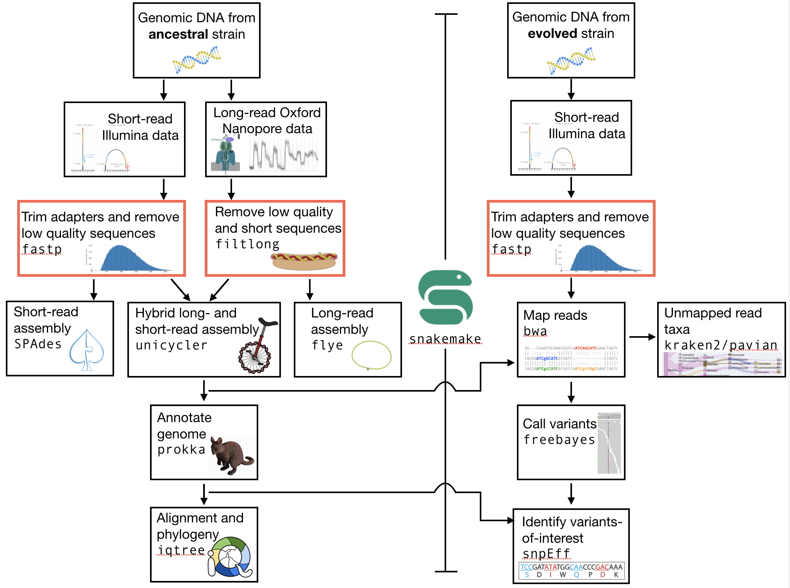
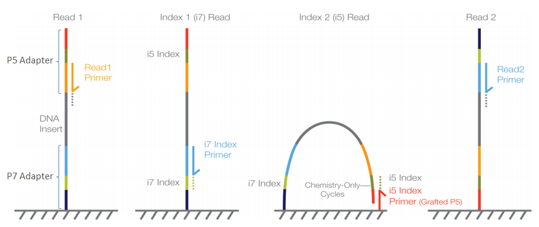
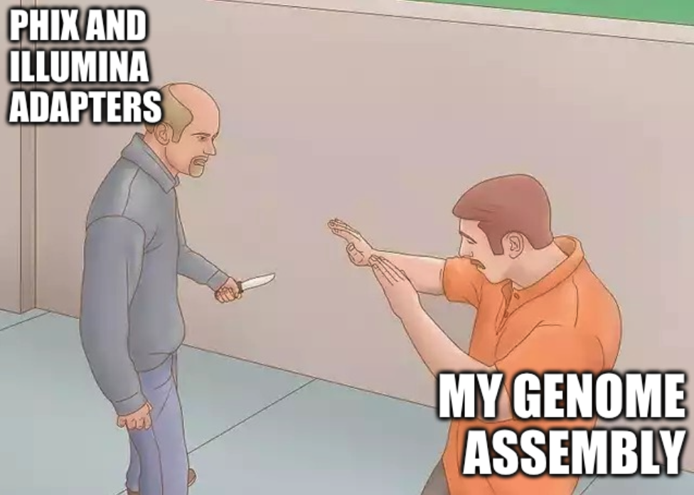
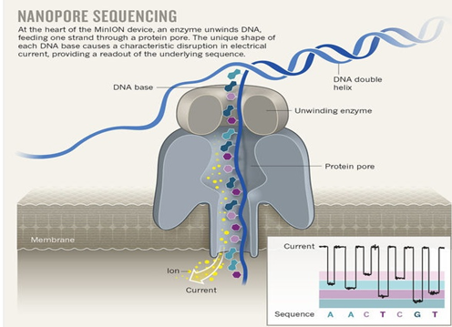

.. _ngs-qc:

Quality control
===============

Preface
-------

There are many sources of errors that can influence the quality of your sequencing run [ROBASKY2014]_.
In this quality control section we will use our newly developed skills on the
command-line interface to deal with the task of investigating the quality and cleaning sequencing data [KIRCHNER2014]_.

.. NOTE::

   You will encounter some **To-do** sections at times. Write the solutions and answers into a text-file, with the laboratory sections and dates noted for all entries. At the end of the Semester, you will need to submit this file for marking.

   
Overview
--------

The part of the workflow we will work on in this section can be viewed in :numref:`fig-workflow-qc`.

.. _fig-workflow-qc:

   The part of the workflow we will work on in this section marked in red.
   

Learning outcomes
-----------------

After studying this tutorial you should be able to:

  #. Describe the steps involved in pre-processing/cleaning sequencing data, including both short-read (Illumina) and long-read (Oxford Nanopore) data.
  #. Distinguish between good and bad sequencing data.
  #. Compute, investigate and evaluate the quality of sequence data from a sequencing experiment.
   
Reminder: the experimental setup
--------
The data we will analyse is from a laboratory evolution experiment in which several different natural isolates of *E. coli* were evolved for approximately 150 generations in culture medium containing increasing amounts of an antibioticv(control lineages were evolved in the absence of antibiotic). After this, genomes of the ancestral (un-evolved) bacteria were sequenced using both short-read (Illumina) and long-read (Oxford Nanoppore) technology. The genomes of the evolved bacteria were re-sequenced using only short-read (Illumina) technology.

Again, the overarching goals of this tutorial are to:
  #. Use the sequence data from the natural isolate ancestor to assemble a high-quality reference genome.
  #. Annotate the ancestral genome so that you know where the open reading frames, rRNAs, tRNAs, and other genomic features are.
  #. Understand how the natural isolate that you have selected relates to other strains of *E. coli* and *Shigella*.
  #. Compare the sequence data of the ancestral and the evolved clones to understand what genomic changes have occurred during evolution.
  #. Construct hypotheses as to why specific genome changes occurred during the laboratory evolution.

.. Attention::
    There are three different natural isolates of *E. coli* that we used in this experiment, and two experimental treatments. Each of you will analyse one and only one isolate and one and only one experimental treatment. Discuss with your neighbours to ensure that you are not all analysing the same natural isolate. The different isolates are designated A5, H7, and H8.

Structuring your directories
--------
Remember from previously that it is critical to maintain a well organised and logical framework for doing your work in. Let's first check which directory you are currently sitting in. Type: ``pwd`` (*print working directory*). You should be in your home directory. If not, change to your home directory by typing ``cd``.

It would be a good idea to create a new directory for the analysis of the data in this course. Make that directory now. The name should be something sensible (and ideally obvious), perhaps ``genome_analysis``. If you cannot remember how to make a directory, refer to the section on *The command line interface*, the *Quick command reference*, or google it.

Change into this new directory that you have created.

.. code-block:: bash

   # change into your directory
   cd mydir

This will be the directory that you do all your analyses in for this class.

The analysis we are doing now will be quality control of our sequence data. We will fetch this data in the next section, but first we should further organise our directories. Make a new directory called ``data`` or something similar. Change into that directory. Now we have an project directory and a data directory for that project.

.. Attention::
    We are missing something, no?
    
    Change back to your ``genome_analysis`` directory and make a README text file. This file should contain information on the project, and could also include (for example) that you will analyse an evolved lineage of a specific *E. coli* strain, and that the first step in your data analysis will be Quality Control. From the command line, there are a few basic "text editors" that can be used to make a text file. Some of the most common are ``vim``, ``emacs``, and ``nano``. Unless you are well-acquainted with ``vim`` or ``emacs`` I recommend trying ``nano``. To do so, simply type ``nano`` on the command line, and a barebones text editor will appear. Use this to write your README.txt file.

The short-read Illumina data
--------

First, we are going to download the short-read Illumina data.

.. code-block:: bash

   # while in your /data directory, create a directory for the illumina data
   mkdir illumina

   # change into the directory
   cd illumina

   # copy the data into your own directory
   # I will let you know where the data is stored
   cp illumina.fastq.tar.gz mydir/

   # uncompress it using the command gunzip
   gunzip illumina.fastq.gz

This should give you a nice looking set of directories and files sort of like this (for example):

.. code-block:: bash

   # look at dir
   # the precise way this looks will 
   # depend on which data you are using
   # (and whether you have unzipped)
   tree

   .
   ├── data
   │   └── illumina
   │       ├── H8_anc_R1.fastq.gz
   │       └── H8_anc_R2.fastq.gz
   └── README.txt

   # look in more detail
   ls -lh data/illumina
   -rwxrwxr-x 1 olin olin 219M Feb  5 12:26 H8_anc_R1.fastq.gz
   -rwxrwxr-x 1 olin olin 176M Feb  5 12:26 H8_anc_R2.fastq.gz

.. note::

   If you want you can now change the file permissions on
   this data. This will ensure that you don't delete it
   or overwrite it by accident. To do this, first check
   the file permission using ``ll`` or ``ls -lh``. The permissions
   are listed in order of who can perform the action and the specific
   action: ``r`` is read, ``w`` is write, ``x`` is execute. To
   prevent accidental deletion, make dure you are sitting *above* your ``data/`` directory and type ``chmod -R 555 data``. This is 
   a slightly complicated command and syntax, so we shan't discuss it
   here. If you now type ``ls -lh`` you should see that your permissions have changed. 

The data is from a paired-end sequencing run data (see :numref:`fig-pairedend`) from an |illumina| MiSeq [GLENN2011]_.
Thus, we have two files, one for each end of the read. 

.. _fig-pairedend:

   Illumina sequencing.

We have covered the basics of this sequencing technology in lecture, but if you need a refresher on how |illumina| paired-end sequencing works have a
look at the `Illumina
technology webpage <http://www.illumina.com/technology/next-generation-sequencing/paired-end-sequencing_assay.html>`__
and this `video <https://youtu.be/HMyCqWhwB8E>`__. 

.. attention::

   The data we are using is almost raw data as is produced from the machine (after basecalling). However, this data has been post-processed in two ways already. First, all sequences that were identified as belonging to the phiX174 bacteriophage genome have been removed. This process requires some skills we will learn in later sections. Second, the |illumina| sequencing adapters have been removed as well. However, we will double check this below.

  
This leads us to:    

The fastq file format
---------------------

The data we receive from the sequencing is in ``fastq`` format. To remind us what this format entails, we can revisit the `fastq wikipedia-page <https://en.wikipedia.org/wiki/FASTQ_format>`__!

A useful tool to decode base qualities can be found `here <http://broadinstitute.github.io/picard/explain-qualities.html>`__.

What do the sequences in your ``fastq`` file look like? The easiest and fastest way to see is **not** to open the file (**it's very large**), but to peek inside of it. There are several ways to do this. Perhaps you just want to see the first few lines of the file. In this case you could use:

.. code:: bash

    head myfile.fastq

Or maybe you would like to see the first 20 lines:

.. code-block:: bash

    head -20 myfile.fastq

Or maybe you would like to see the last few lines:

.. code-block:: bash

    tail myfile.fastq

Or perhaps the whole file in screen-sized chunks:

.. code-block:: bash

    less myfile.fastq

(type ``q`` to exit ``less``)

Or perhaps see how big the file is in terms of lines and characters:

.. code-block:: bash

    wc myfile.fastq

Look briefly at the manual for ``wc`` to understand the values that it prints on the screen.

.. todo::

   Explain what the quality score represents.

Investigate the data
~~~~~~~~~~~~~~~~~~~~

Make use of your newly developed skills on the command-line to
investigate the files in your ``data`` folder.

.. todo::

    Use the command-line to get some ideas about the file.
       #. What kind of files are we dealing with?
       #. How many sequence reads are in the file (try using the ``wc`` command)?
       #. Assume that your bacteria has a genome size of 5 Mbp. Calculate the coverage based on this formula: ``gen.cov = read.len * read.num / gen.size``

    - ``gen.cov``: Genome coverage
    - ``gen.size``: is the haploid genome size in bp
    - ``read.len``: is the read length in bp (e.g. 2x100 paired-end = 200)
    - ``read.num``: is the number of reads sequenced

Well done!

But maybe you're lazy and are wondering: isn't there a simple tool out there that can do this for me? Of course, you could **google** this, but there is another option - rely on the bioinformatic expertise of others. It turns out that there *is* a very simple and easy-to-use command line tool for getting ``.fastq`` stats. This is ``seqkit`` (well, it's one of many). Usage:

.. code-block:: bash

    seqkit --help

    Usage:
    seqkit [command]

    Available Commands:
      amplicon        retrieve amplicon (or specific region around it) via primer(s)
      bam             monitoring and online histograms of BAM record features
      common          find common sequences of multiple files by id/name/sequence
      concat          concatenate sequences with same ID from multiple files
      etc.

    # simple usage
    seqkit stats myfile.fastq

    # slightly more complex
    # for all the files and more stats
    # note the "*" wildcard character
    seqkit stats -a *.fastq

.. attention::
    Of course you need to install it first: ``conda install -c bioconda seqkit``.

The short-read QC process
--------------

There are a few steps one need to do when getting the raw sequencing data from the Illumina sequencing facility:

#. Remove PhiX sequences
#. Trim adapters
#. Quality trim reads
#. Assess quality
   

Watch out: phiX174 DNA
~~~~~~~~~~~~~~~~

`phiX174 <https://en.wikipedia.org/wiki/Phi_X_174>`_ (phiX for short) is a non-tailed bacteriophage with a single-stranded DNA genome of 5386 nucleotides.
Please take a minute to read `this page <http://www.illumina.com/products/by-type/sequencing-kits/cluster-gen-sequencing-reagents/phix-control-v3.html>`_, describing how PhiX is used as a quality and calibration control for sequencing runs. Briefly,
PhiX is often added at a low known concentration, spiked in the same "lane" of the Illumina flow cell, along with the sample or used as a separate lane.
As the concentration of the genome is known, one can calibrate the instruments, which is required for collecting accurate data. The PhiX DNA also serves as a positive control (we know the DNA is of high quality).

This means that after sequencing, PhiX genomic sequences need to be removed before processing your data further, as this constitutes a deliberate contamination [MUKHERJEE2015]_.
The steps involve mapping all reads to the "known" phiX genome, and removing all of those sequence reads from the data.

However, your sequencing provider might not have used phiX. Thus you should read the protocol carefully, or just do this step in any case.

.. attention::

   We are **not** going to do this step here, as this has been already done. We will cover read mapping against a reference genome in the :ref:`ngs-mapping` section.

Adapter and read trimming
~~~~~~~~~~~~~~~~~

The process of sequencing DNA via |illumina| technology requires the addition of some adapters to the sequences.
These get sequenced as well and need to be removed as they are artificial and do not belong to the species we try to sequence (:numref:`fig-trim`). Don't be like `these people <http://www.opiniomics.org/we-need-to-stop-making-this-simple-fcking-mistake/>`_.

.. _fig-trim:

   Always trim and QC before genome assembly.
   
First, we need to know the adapter sequences that were used during the sequencing of our samples.
Normally, you  might ask your sequencing provider, who should be providing this information to you.
|illumina| itself provides a `document <https://support.illumina.com/downloads/illumina-customer-sequence-letter.html>`__ that describes the adapters used for their different technologies.

However, many quality control software programs will automatically search for a range of adapters, which simplifies the process for us. The |fastp| tool that we will be using `does exactly this <https://github.com/OpenGene/fastp#adaptersp>`__. So let us begin the QC process. You can see all the options available for ``fastp`` by simply typing the command. **Please do this first.**

The result of typing ``fastp`` should let you see that
one option for a set of arguments is:

.. code-block:: bash
    
    # note that the \ at the end of the line allows the command to run
    # over multiple lines. It's a back slash not a forward slash :)
    # Also note that the .json and .html files must have the full
    # suffix fastp.json and fastp.html for the next tool that you will use
    # That tool is MultiQC
    # Steel yourself for the length of this command.
    fastp -i my_anc_file_R1.fastq -I my_anc_file_R2.fastq \
    -o my_anc_file_R1_trimmed.fastq -O my_anc_file_R2_trimmed.fastq --verbose \
    -j my_anc_file.fastp.json -h my_anc_file.fastp.html

.. Attention::
 
	#. Also run |fastp| on the evolved ``.fastq`` files. 

.. hint::

   Did the ``fastp`` command not work? Remember that if you want to use a new software tool that you have not used yet, it is very likely that you will have to install it. Make sure that you have your conda environment activated (``conda activate ngs``) and then install ``fastp``: ``conda install -c bioconda fastp``

Visualising the results of the short-read QC process 
---------------------------

Run MultiQC
~~~~~~~~~~~~~~

To understand in more detail what the data look like and the results of the trimming process we will view and compare the reports produced by fastp. The tool we will do this with is |multiqc|, and it is available on the ``bioconda`` channel as ``multiqc``. Install it now (as you did with ``fastp``: ``conda install -c bioconda multiqc``). We will also use MultiQC later in the course to understand the results of various tools we apply. This is how MultiQC is used:

.. code-block:: bash
 
    multiqc --help

    Usage: multiqc [OPTIONS] <analysis directory>

    Main MultiQC run command for use with the click command line, complete
    with all click function decorators. To make it easy to use MultiQC within
    notebooks and other locations that don't need click, we simply pass the
    parsed variables on to a vanilla python function.

    Options:
      -f, --force                     Overwrite any existing reports
      -d, --dirs                      Prepend directory to sample names
      -dd, --dirs-depth INTEGER       Prepend [INT] directories to sample names.
                                      Negative number to take from start of path.

      -s, --fullnames                 Do not clean the sample names (leave as full
                                      file name)

      -i, --title TEXT                Report title. Printed as page header, used
                                      for filename if not otherwise specified.

      -b, --comment TEXT              Custom comment, will be printed at the top
                                      of the report.

      -n, --filename TEXT             Report filename. Use 'stdout' to print to
                                      standard out.

      -o, --outdir TEXT               Create report in the specified output
                                      directory.

    # so for example we could have something as simple as
    # the following (looks in the current directory for 
    # fastp reports)
    multiqc .

View the results
~~~~~~~~~~~~~~

MultiQC will output the results into a format that can be opened in a web browser. If  you have done the above steps correctly, you should now have a file called ``multiqc_report.html`` or similar. In order to view this you will have to download it onto your VM desktop because it cannot be viewed remotely (you cna only interact with ``agnes`` on the command line). To download the file simply type: 

.. code-block:: bash
   
   # Replace "yourname" with your own name
   # and make sure that the names directories following the ~ correspond exactly to the
   # names of the directories that your have made on agnes
   # Remember that the last ./ means that you will copy the files into the directory you
   # are currently sitting in.
   # You will have to type your password to start downloading
   # Note also that you will not be able to tab-complete your directory names :(
   rsync -az --progress yourname@130.123.252.43:~/genome_analysis/data/illumina/multiqc ./

Explanation: ``rsync`` is a program that *syncs* (copies) files and directories across computers. It has the convenient feature that before it copies files over, it checks whether they already exist. If they do, it does not copy them. This is critical
if you are using a connection that is likely to be interrupted. The rest of the line specifies a few arguments, most importantly *progress*, which tells you how far along the file transfer is.

The long-read Oxford Nanopore data
--------

Filtering the long read data
~~~~~~~~~~~~~~

Let's now take a look at the long-read data. First, we need to download it:

.. code-block:: bash
 
    # create a directory while in your /data directory
    mkdir nanopore

    # change into that directory
    cd nanopore

    # download the data

    # let's NOT uncompress it for now

This data differs from the Illumina data most significantly in how it was generated. Remember, the process of sequencing DNA via Illumina chemistry (sequencing-by-synthesis) is very different than sequencing DNA by passing it through a pore (see :numref:`fig-ont`)).

.. _fig-ont:

    
    Nanopore sequencing.

Although later in this tutorial we will be combining the Illumina and Nanopore data, it is important to remember that there are considerable differences in the outputs from these two sequencing platforms. While Illumina data yields *only* short-read DNA, Oxford Nanopore can yield a wide range of lengths (up to 2 *million* base pairs), for both DNA and RNA, and can detect a wide number of covalent modifications (even ones we don't yet know about), and *finally*, it does all this on a device the half the size of your cell phone. (Having said all that, Illumina has a very wide array of applications as the sequencing output is so very enormous). From a sequencing point of view though, I view it sort of like this (see :numref:`fig-ont-ill`).

.. _fig-ont-ill:

    
    They're different.

As this is long-read data, we will use a slightly different process to filter low-quality reads. In contrast to the Illumina data, this data has reads of very different lengths. We will thus process it using a different software package, `filtlong <https://github.com/rrwick/Filtlong>`_. `filtlong` quality filters reads on the basis of both read length *and* read quality. To run it, we follow these basic steps:

.. code-block:: bash
 
    # install filtlong using conda (it is in the bioconda channel)
    # I'll let you do this on your own
    
    # what does filtlong do
    filtlong --help
    usage: filtlong {OPTIONS} [input_reads]
    Filtlong: a quality filtering tool for Nanopore and PacBio reads

    positional arguments:
        input_reads                         input long reads to be filtered

    optional arguments:
        output thresholds:
            -t[int], --target_bases [int]       keep only the best reads up to this many total bases
            -p[float], --keep_percent [float]   keep only this percentage of the best reads (measured by bases)
            --min_length [int]                  minimum length threshold
            --min_mean_q [float]                minimum mean quality threshold
            --min_window_q [float]              minimum window quality threshold

        external references (if provided, read quality will be determined using these instead of from the Phred scores):
            -a[file], --assembly [file]         reference assembly in FASTA format
            -1[file], --illumina_1 [file]       reference Illumina reads in FASTQ format
            -2[file], --illumina_2 [file]       reference Illumina reads in FASTQ format

        score weights (control the relative contribution of each score to the final read score):
            --length_weight [float]             weight given to the length score (default: 1)
            --mean_q_weight [float]             weight given to the mean quality score (default: 1)
            --window_q_weight [float]           weight given to the window quality score (default: 1)

        read manipulation:
            --trim                              trim non-k-mer-matching bases from start/end of reads
            --split [split]                     split reads at this many (or more) consecutive non-k-mer-matching bases

        other:
            --window_size [int]                 size of sliding window used when measuring window quality (default: 250)
            --verbose                           verbose output to stderr with info for each read
            --version                           display the program version and quit

        -h, --help                          display this help menu

.. code-block:: bash
 
    # basic filtlong usage assuming you want ~100X coverage for your 5Mbp bacterial genome
    filtlong --min_length 1000 --keep_percent 90 --target_bases 500000000 input.fastq.gz | gzip > output.fastq.gz

.. todo::

   We do not need long-read data for the evolved bacteria, as well not be making an assembly. Thus, you will only need to filter the long-read data for the ancestor.

   Why would we not need long read data if we are not dong an assembly?

Viewing the results
~~~~~~~~~~~~~~

We will only perform a quick summary of the results here rather than the interactive |fastp| report we viewed earlier. For this we will aggain use the simple but powerful ``seqkit`` program.

.. code-block:: bash
 
    # install seqkit using conda (it is in the bioconda channel)
    # I'll let you do this on your own

    # use seqkit on the unfiltered data
    seqkit stats -a unfiltered.fastq

    # use seqtk on the filtered data
    seqkit stats -a filtered.fastq

.. todo::
 
  How do the unfiltered and filtered sequencing datasets differ? Explain each of the metrics that ``seqkit`` gives you and why those are important for understanding your sequence quality.

Next: Assembling a genome

.. only:: html

   .. rubric:: References

               

.. [GLENN2011] Glenn T. Field guide to next-generation DNA sequencers. `Molecular Ecology Resources (2011) 11, 759–769 doi: 10.1111/j.1755-0998.2011.03024.x <http://doi.org/10.1111/j.1755-0998.2011.03024.x>`__

.. [KIRCHNER2014] Kirchner et al. Addressing challenges in the production and analysis of Illumina sequencing data. `BMC Genomics (2011) 12:382 <http://doi.org/10.1186/1471-2164-12-382>`__

.. [MUKHERJEE2015] Mukherjee S, Huntemann M, Ivanova N, Kyrpides NC and Pati A. Large-scale contamination of microbial isolate genomes by Illumina PhiX control. `Standards in Genomic Sciences, 2015, 10:18. DOI: 10.1186/1944-3277-10-18 <http://doi.org/10.1186/1944-3277-10-18>`__

.. [ROBASKY2014] Robasky et al. The role of replicates for error mitigation in next-generation sequencing. `Nature Reviews Genetics (2014) 15, 56-62 <http://doi.org/10.1038/nrg3655>`__
