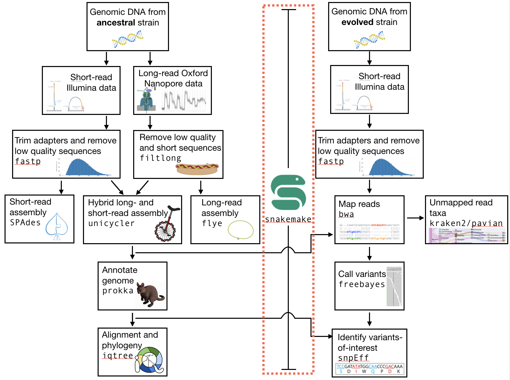
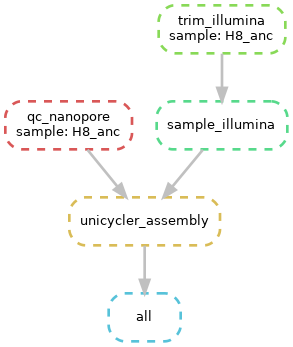

.. _ngs-snakemake:

Snakemake - automation and reproducibility
=================

Preface
-------

At the start of this tutorial, we discussed the importance of making analyses easy to reproduce. That way, you can re-analyse new data using the same methods as you did previously, have other people analyse your data, or just have a clear record of what steps occurred inn your analyses.

To do all of these things, we will begin using a workflow manager, `Snakemake <https://snakemake.readthedocs.io/en/stable/>`_

Overview
--------

The part of the workflow we will work on in this section can be viewed in :numref:`fig-workflow-voi`.

.. _fig-workflow-voi:

    
    The part of the workflow we will work on in this section marked in red.

Learning outcomes
-----------------

After studying this section of the tutorial you should be able to:

#. Explain the advantages of using a workflow manager
#. Use a workflow manager (|snakemake|) to manage your workflows
#. Explain how to utilise workflow "rules" to execute certain workflow steps

Before we start
---------------

Lets see what our directory structure looks like so far:

.. code:: bash

    # a nice tree-like structure
    # Here we only look two levels down (-L 2)
    # each of yours will look different
    # but should have a data/ directory
    tree -L 2

Installing the software
-----------------------

.. code:: bash

          # Of course you activate your conda env
          conda activate ngs
          
          # Then you need snakemake
          conda install -c bioconda snakemake

Structuring the workflow
-------------------------

Read through **all** the instructions in the next two sections (*Snakemake rules* and *One rule to rule them all*) **before** beginning to write your workflow. You will manage your workflow from the primary directory that you have created, in which your ``/data`` subdirectory sits. For example, this could be ``genome_analysis``.

As a workflow manager, |snakemake| works on the principal that all you have to tell it is what input files you have and what output files you would like, and it will execute all the necessary steps ("rules") to create the output files (and *only* those steps). Furthermore, it will only execute those steps if your input files are *newer* than your output files. If your output files have been made *after* your input files, |snakemake| will assume that you have already done the analysis, and it will thus do nothing.

For example, if you think back to the workflow for the QC steps that we did in the previous section of the tutorial, we had several input files to perform QC on and several output files that resulted from that QC. Previously we performed all the QC steps separately. While this helps us considerably in understanding what is happening during each step, it makes repeating the entire process quite difficult. Not only do you first have to remember the commands and the order in which you typed them, you also have to type the commands several times - once for each set of files you want to analyse.

The |snakemake| workflow manager will simplify this entire process, making it simple and painless for you, or for anyone, to repeat the process.

Snakemake rules
~~~~~~~~~~~~~~~~

As explained above, you tell Snakemake what input you *have* (i.e. which files) and what output you *desire* (i.e. which files), and |snakemake| tries to produce the output file(s) from the input file(s) using a series of steps or rules. In its simplest form, a rule requires you to specify an input file, an output file, and a command of some sort telling it what to do with the input file (usually so that it can create the output file). For example, in your ``Snakefile`` text file, this could look like this: 

.. code:: bash

    # Note that we are writing all of this in a text file, not
    # on the command line.
    # We need a name for our rule and it should make sense
    rule trim_illumina:
      # and here's the input for the rule (what we are providing)
      input:
        "data/illumina/myfile.R1.fastq"
      # and here's the output (what we expect to get)
      output:
        "results/myfile.R1.trimmed.fastq"
      # and here's the command - how we can go from the input file 
      # to the output file
      shell:
        "fastp -i {input} -o {output}"

This would take an input ``.fastq`` file and use the |fastp| program to create a ``trimmed.fastq`` with trimmed reads. Note that the |fastp| program must exist (although we will take care of this possible problem later). Note also that ``snakemake`` will only look where you tell it to look for the input file (i.e. here it will look for ``data/illumina/myfile.R1.fastq``) - more on that later.

One rule to rule them all
~~~~~~~~~~~~~~~~~~~~~~~~~

The first thing |snakemake| does when trying to figure out what it needs to do is look for a rule in your ``Snakefile`` text file called ``all`` (:numref:`fig-all`).

.. _fig-all:

    rule all specifies the file(s) that you want once your workflow is completed.

In the ``rule all`` rule, you need to define all the output files that you desire. |snakemake| will then try to create these files by searching through and executing other rules. For the QC steps, your all rule might look something like this:

.. code:: bash

    rule all:
      input:
        "results/myfile.R1.trimmed.fastq"

|snakemake| will then search your ``Snakefile`` for another rule that has as an output ``results/myfile.R1.trimmed.fastq``. But look! We have already written such a rule above! Creating a workflow is as simple as writing these two rules into a single ``Snakefile``.

A simple snakemake workflow
~~~~~~~~~~~~~~~~~~~~~~~~~
Write your first workflow by opening the ``nano`` editor and writing in the two rules discussed above. I have put a lot of comments below (lines preceeded by ``#``) - you do not need all of these.

.. code:: bash

    # open nano
    $ nano

    # Once you are in the editor,
    # add the rules, with the "all" rules at the top
    # and the trim rule next. Make sure that you follow
    # the structure above, and indent properly.
    # A good rule to follow is to use four spaces when you indent.
    # At the end, save and exit, naming your file "Snakefile" (no extension)
    rule all:
      input:
        "results/myfile.R1.trimmed.fastq"

    rule trim_illumina:
      input:
        "data/illumina/myfile.R1.fastq"
      output:
        "results/myfile.R1.trimmed.fastq"
      shell:
        "fastp -i {input} -o {output}"

Let's now see what our workflow will do (or, *attempt* to do). To dry-run |snakemake|, simply type ``snakemake -np``. |snakemake| will look for a file called ``Snakefile`` and tell you the rules that it will execute (if any).

In this case, it first looks at the rule ``all`` and sees that you would like a file called
``results/myfile.R1.trimmed.fastq`` - in other words, a trimmed fastq file that sits in
a directory called ``results`` (a directory which in fact does not yet exist). At this point ``snakemake`` looks around to see if this file already exists (it does not of course), or if there is another rule that would create this trimmed fastq file (i.e. the output is ``results/myfile.R1.trimmed.fastq``). At this point it finds a rule that would create this file - your ``rule trim_fastq``. Now it goes there and checks what input is needed. It sees that ``data/myfile.R1.fastq`` is needed. Now, again, it checks if the file already exists, or if there is a rule to make this file.

It should find that this file *does* exist - in your ``data`` directory. If the file doesn't exist, and if there is no rule to create that file, it will error out and try to tell you why.

.. attention::
  You need to make sure that you correctly specify the locations of your input and output files. For example, you should (generally) execute |snakemake| from with the top-level of your analysis directory. If you have used the directory structure specified in the QC section of the tutorial, then your Illumina reads sit in ``data/illumina``. Ensure that you specify this full path. Similarly, you should structure your output. I recommend putting the results of your analysis into a ``results`` directory. |snakemake| *does* have the useful feature that it will create directories that do not exist. Thus, you can ask it to output to the ``results/`` directory without that directory actually existing. |snakemake| will then create that directory.

Now if you are satisfied that the ``snakemake`` dry-run does what you would like, you can go ahead and execute a real run. Note that we need one more argument in this case - the ``-j``. This specifies how many `cores <https://en.wikipedia.org/wiki/Central_processing_unit>`_ to use when snakemake runs. This computer that you *happen* to be using has 24 processors, each of which has two cores, for a total of 48 cores. (You can type ``htop`` to see the cores that are available; type ``q`` to exit ``htop``)

.. code:: bash

    # hope this works
    snakemake -p -j 2

If everything has worked as planned, then you should have a new set of trimmed ``.fastq`` files in your ``results/`` directory.

Wildcards
~~~~~~~~~~~~~~~~~~~~~~~~~

However, the above instructions have resulted in trimming only a single read file. It is *much* more likely that you will actually want to trim multiple read files, and you do not want to have to type each command individually. In this case, you can *once again* rely on the power of ``snakemake`` to solve your problem.

Now we will use a file matching strategy that is identical to using a ``*`` wildcard character to recognize *all* files that we might want to trim.

This will get a little bit tricky at first and require some explanation. First, let's review what the ``*`` character does as a "wildcard". Here are a few resources; some might be more intuitive than others: `geek university <https://geek-university.com/linux/wildcard/#:~:text=A%20wildcard%20in%20Linux%20is,begin%20with%20the%20letter%20O>`_, `ryans tutorials <https://ryanstutorials.net/linuxtutorial/wildcards.php>`_, `Indiana University <https://kb.iu.edu/d/ahsf#:~:text=The%20asterisk%20(%20*%20),-The%20asterisk%20represents&text=Use%20it%20when%20searching%20for,you%20have%20only%20partial%20names.&text=For%20most%20web%20search%20engines,documents%20with%20that%20one%20word>`_.

On a basic level: on the command line, the ``*`` character will match *any* number of *unknown* letters or numbers when you are looking for a file or a directory. For example:

.. code:: bash

    # list all files in the directory
    # Here we get all the files. I want to look at fewer.
    ls -lh

    # output
    total 4.9G
    -rw-rw-r-- 1 olin olin 518K Mar  1 11:04 H8_anc.fastp.html
    -rw-rw-r-- 1 olin olin 158K Mar  1 11:04 H8_anc.fastp.json
    -rwxrwxr-x 1 olin olin 597M Mar  1 10:08 H8_anc_R1.fastq
    -rw-rw-r-- 1 olin olin 597M Mar  1 11:04 H8_anc_R1_trimmed.fastq
    -rwxrwxr-x 1 olin olin 484M Mar  1 10:09 H8_anc_R2.fastq
    -rw-rw-r-- 1 olin olin 483M Mar  1 11:04 H8_anc_R2_trimmed.fastq
    -rw-rw-r-- 1 olin olin 477K Mar  1 11:15 H8_evolved.fastp.html
    -rw-rw-r-- 1 olin olin 133K Mar  1 11:15 H8_evolved.fastp.json
    -rwxrwxr-x 1 olin olin 709M Mar  1 11:10 H8_evolved_R1.fastq
    -rw-rw-r-- 1 olin olin 696M Mar  1 11:15 H8_evolved_R1_trimmed.fastq
    -rwxrwxr-x 1 olin olin 709M Mar  1 11:10 H8_evolved_R2.fastq
    -rw-rw-r-- 1 olin olin 696M Mar  1 11:15 H8_evolved_R2_trimmed.fastq
    drwxrwxr-x 2 olin olin 4.0K Mar  1 11:22 multiqc_data
    -rw-rw-r-- 1 olin olin 1.1M Mar  1 11:22 multiqc_report.html

.. code:: bash

    # List ONLY files that have "R1" at the start, end, or middle
    # Here we use the wildcard * twice (once at the start and
    # once at the end) to match ANY START or END characters
    # Note that here you cannot tab complete the name
    ls -lh *R1*

    -rwxrwxr-x 1 olin olin 597M Mar  1 10:08 H8_anc_R1.fastq
    -rw-rw-r-- 1 olin olin 597M Mar  1 11:04 H8_anc_R1_trimmed.fastq
    -rwxrwxr-x 1 olin olin 709M Mar  1 11:10 H8_evolved_R1.fastq
    -rw-rw-r-- 1 olin olin 696M Mar  1 11:15 H8_evolved_R1_trimmed.fastq

.. code:: bash

    # list ONLY files that have "fastq" at the END.
    # Here we use a * at the START to match any 
    # letters / numbers at the  beginning
    # Again, you cannot tab complete the name
    ls -lh *fastq

    -rwxrwxr-x 1 olin olin 597M Mar  1 10:08 H8_anc_R1.fastq
    -rw-rw-r-- 1 olin olin 597M Mar  1 11:04 H8_anc_R1_trimmed.fastq
    -rwxrwxr-x 1 olin olin 484M Mar  1 10:09 H8_anc_R2.fastq
    -rw-rw-r-- 1 olin olin 483M Mar  1 11:04 H8_anc_R2_trimmed.fastq
    -rwxrwxr-x 1 olin olin 709M Mar  1 11:10 H8_evolved_R1.fastq
    -rw-rw-r-- 1 olin olin 696M Mar  1 11:15 H8_evolved_R1_trimmed.fastq
    -rwxrwxr-x 1 olin olin 709M Mar  1 11:10 H8_evolved_R2.fastq
    -rw-rw-r-- 1 olin olin 696M Mar  1 11:15 H8_evolved_R2_trimmed.fastq

.. code:: bash

    # list ONLY files that have "H8_evol" at the START
    # Here we use a * at the END to match any letters/numbers
    # at the end
    # Again, you cannot tab complete the name
    ls -lh H8_evol*

    -rw-rw-r-- 1 olin olin 477K Mar  1 11:15 H8_evolved.fastp.html
    -rw-rw-r-- 1 olin olin 133K Mar  1 11:15 H8_evolved.fastp.json
    -rwxrwxr-x 1 olin olin 709M Mar  1 11:10 H8_evolved_R1.fastq
    -rw-rw-r-- 1 olin olin 696M Mar  1 11:15 H8_evolved_R1_trimmed.fastq
    -rwxrwxr-x 1 olin olin 709M Mar  1 11:10 H8_evolved_R2.fastq
    -rw-rw-r-- 1 olin olin 696M Mar  1 11:15 H8_evolved_R2_trimmed.fastq

The Snakemake ``glob_wildcards`` function
~~~~~~~~~~~~~~~~~~~~~~~~~

We are now going to use the ``*`` to our advantage by adding a line to your ``Snakefile``. However, instead of writing it as an asterisk ``*``, you are going to immediately assign the matches that it finds to a new variable. Here, we name this variable ``sample``, and designate it as a variable with the ``{}`` curly brackets. To do this, you need to add a line at the very top of your Snakefile: ``STRAINS, = glob_wildcards("./data/illumina/{sample}_R1.fastq")``.

Do this now by editing your ``Snakefile`` using the ``nano`` text editor.

**Explanation**: in this case, the bracketed portion, ``{sample}``, is acting as a wildcard, and is matching *any* file that starts with ``./data/illumina/`` and *ends* in ``_R1.fastq``. (Note that this means it is looking in the ``./data/illumina/`` directory). Why are we doing this? Well, we know that all Illumina data that we are dealing with is in that directory, but is also paired end. And we know that we *don't* want to separately QC Read1 and Read2. So you will be able find all the samples to QC by *only* matching the Read1 (R1) samples, with the knowledge that if everything is named consistently, each of the R1 sample ``.fastq`` files will have a corresponding R2 ``.fastq`` file.

In fact, we can check which files the Snakefile would find. Return to the command line and try typing ``ls -lh ./data/illumina/*_R1.fastq`` (i.e. substitute ``{sample}`` with ``*``). You should find that it lists all the R1 reads for the samples that you want to QC and nothing more - namely one ancestor file and one evolved file (in your case). You could imagine, however, that this would also be possible if you had fifty files in the directory, and all of these files had different names or sample identifiers, and *all* of them had both R1 and R2 designations.

**Note**: The second thing we have done is to assign the list of these ``{sample}`` variables to a list of all variables. This list is ``STRAINS``, and it is capitalised because it is a list of all *important* variables. We are using a specific *function* in python to do so, the `glob_wildcards <https://snakemake.readthedocs.io/en/stable/project_info/faq.html#how-do-i-run-my-rule-on-all-files-of-a-certain-directory>`_ function.

Now that you have this list (obtained using ``glob_wildcards``), we can proceed with the rest of the Snakefile and workflow.

The Snakemake ``expand`` function
~~~~~~~~~~~~~~~~~~~~~~~~~

Above, we have used ``glob_wildcards`` to find all input files so that we don't have to specify them individually. We would like to use something similar to *infer* all output files so that we don't have to specify them individually. In this case we will use the ``expand`` function to infer all output files.

Remember that we have stored the names of all our input files in the list ``STRAINS``. We will now use this stored list to our advatnage by combining it with the ``expand`` function. Specifically, we can write:

.. code:: bash

    # find all samples in the illumina folder that match "R1.fastq"
    STRAINS, = glob_wildcards("./data/illumina/{sample}_R1.fastq")

    # change the rule all so that it looks for all samples
    # Note that the {samples} here is not a wildcard but is
    # looking at the list stored in STRAINS
    rule all:
        input:
            expand("results/{sample}.R1.trimmed.fastq", sample=STRAINS)

    # change the QC rule so that it QCs all samples
    rule trim_illumina:
        input:
            "data/illumina/{sample}.R1.fastq"
        output:
            "results/{sample}.R1.trimmed.fastq"
        shell:
            "fastp -i {input} -o {output}"

If you change your Snakefile in this way and run it (``snakemake -np`` for a dry-run) you should find that it now will qc all ``*R1.fastq`` files in your ``data/illumina`` directory.

Additional outputs (or inputs)
~~~~~~~~~~~~~~~~~~~~~~~~~
Sometimes you may want to specify multiple input or output files for a rule. This addition is simple - you only need to specify the additional files in a list-like format. For example,
fastp outputs ``html`` and ``json`` files. We would like to ensure those are output, so we need to add them to our Snakefile - first in rule ``all``, and then in the trim rule, so that rule ``all`` knows how to create them. This can be done like so:

.. code:: bash

    # find all samples in the illumina folder that match "R1.fastq"
    STRAINS, = glob_wildcards("./data/illumina/{sample}_R1.fastq")

    # Change the rule all so that it looks for several different
    # files for each of the samples
    rule all:
        input:
            expand("results/{sample}_R1.trimmed.fastq", sample=STRAINS),
            expand("results/{sample}_R2.trimmed.fastq", sample=STRAINS),
            expand("results/{sample}_fastp.json", sample=STRAINS),
            expand("results/{sample}_fastp.html", sample=STRAINS),

    # Change the trim rule so that it has two different inputs and 
    # several different outputs
    rule trim_illumina:
        input:
            R1="data/illumina/{sample}_R1.fastq",
            R2="data/illumina/{sample}_R2.fastq"
        output:
            R1="results/{sample}_R1.trimmed.fastq",
            R2="results/{sample}_R2.trimmed.fastq",
            json="results/{sample}_fastp.json",
            html="results/{sample}_fastp.html",
        # note below that we use the """ notation to allow
        # the command to be on multiple lines 
        # Note also that we specify the input and output files
        # by writing the curly brackets and the "." notation
        # Each of the inputs and outputs are named and then
        # referred to as such.
        shell:
            """
            fastp -i {input.R1} -o {output.R1} \
            -I {input.R2} -O {output.R2} \
            -j {output.json} -h {output.html}
            """

Try changing your Snakefile to follow that format, and attempt a dry-run after you have done so. If that works, go ahead and execute the snakemake (use ``snakemake -p -j 2``). After this, check that it has executed the jobs correctly.

Adding more rules
~~~~~~~~~~~~~~~~~~~~~~~~~

There is no way around it: what we are doing right now complicated (:numref:`fig-complicated`).

.. _fig-complicated:

   Do not be surprised if this is how you feel.
   
However, once we have written down all our rules, we will have created a file that specifies a *workflow* which is *completely* automated. You will be free from the tyranny of repeating analyses and with the press of a button, will be able to repeat them all, *whenever you like.* Do not underestimate this power. You will also be able to easily share your methods with anyone else so that they, too, will be able to repeat the analyses.

So...onward.

Using the wildcard to recognise new files
~~~~~~~~~~~~~~~~~~~~~~~~~

Previously, we performed quality control on our long Oxford Nanopore reads as well. Let's add in a rule to do that! Note that we cannot add it to our ``trim_illumina`` rule, as we performed qc on the Oxford Nanopore reads in a different way - with ``filtlong``. Here, we will use the same wildcard as before, but *we will look for our input in a different directory*! If you do not have your data organised in separate ``Illumina`` and ``Nanopore`` directories, do that now.

.. code:: bash

    # write a new QC rule for nanopore
    # make sure you ADD this to your snakefile
    # Remember the data is .gz (double check that)
    rule qc_nanopore:
        input:
            "data/nanopore/{sample}.fastq.gz"
        output:
            "results/{sample}.hiqual.fastq"
        shell:
            """
            filtlong --min_length 1000 --keep_percent 90 \
            --target_bases 500000000 {input} > {output}
            """

You will now also have to add an input to ``rule all`` that looks for this new output. Try this now.

.. todo::

    There was one step in this process that we have not made a rule for yet - the subsampling. Remember that this step was done with ``seqtk``. Explain the input and output files that you would expect for this rule, and write down the code that you would use to implement this rule. For this rule, instead of sampling a *fraction*, you can simply sample 700,000 reads from each paired end file.

Adding more rules while deleting old rules - simplifying
~~~~~~~~~~~~~~~~~~~~~~~~~
Clearly, our workflow is becoming complicated. There are several input rules for ``rule all``, and there are a rapdly expandng number of other rules. However, we can now begin to simplify our rules *to a small extent*.

Remember that after quality control we performed an assembly. Let's now try to do that. First we will write a rule for only a single assembly, the hybrid ``Unicycler`` assembly. If you remember, this required two different read sets: the short-read *paired end* Illumina reads, and the long-read Oxford Nanopore. When we performed the assembly, we used the trimmed, quality controlled reads.

Let us try to write an assembly rule now. There are three input files: two Illumina files (trimmed) and one Oxford Nanopore file (high quality reads). However, there is now a complicating factor: we are only performing an assembly for the *ancestral* strain. So in this case we will change our rules so that they look *only* for these files and no others.

How might this work? Well, now we are trying to specify only *ancestral* strains. We can solve this problem in several ways. Perhaps the *simplest* is to make two ``Illumina`` directories - one with the ancestral reads, and one with the evolved reads. After all, **we will generally be doing different things with these two sets of reads** (*assembly* with the ancestral reads and *variant calling* with the evolved reads). This is where directory organisation comes to play a *critical* role. To fix our problem, make a new "ancestor" and "evolved" ``Illumina`` directory, and store the proper files in each.

Now we will also have to change the ``glob_wildcards`` rule so that it looks only in the ancestral directory for the strains. In other words, we now need ``STRAINS, = glob_wildcards("./data/illumina/ancestor/{sample}_R1.fastq")`` rather than ``STRAINS, = glob_wildcards("./data/illumina/{sample}_R1.fastq")``. Once that change is made, we can make a new rule for the ``Unicycler`` assembly.

.. code:: bash

    # Write a new assembly rule
    rule unicycler_assembly:
        input:
            nanopore="results/{sample}.hiqual.fastq",
            R1="results/{sample}_R1.trimmed.fastq",
            R2="results/{sample}_R2.trimmed.fastq"

        # This is complicated as we have to know the
        # name of our output assembly, and unicycler
        # does not use the input file names for naming
        # except for the directory. Let's also organise
        # our directory so that we have a specific Unicycler
        # directory.
        output:
            "results/{sample}/unicycler/assembly.fasta"
        # So we have to add a new block that allows 
        # us to specify *parameters*
        params:
            dir="results/{sample}/unicycler"
        shell:
            "unicycler -1 {input.R1} -2 {input.R2} -l {input.nanopore} -o {params.dir}"

Note that this new rule requires the illumina and nanopore quality trimmed data. For this reason, if we specify this assembly file in our rule all, *we no longer need to specify that we need the quality trimmed data*! In fact, you only need to specify a single file in the ``rule all`` - the ``unicycler`` assembly file. Add this input now to your ``rule all``.

Completing the assembly workflow
~~~~~~~~~~~~~~~~~~~~~~~~~

Remember that we performed two additional assemblies previously, the loing-read onlyp (``flye``), and the shnort-read only (``SPAdes``). We will, *of course*, want to adjust our ``Snakefile`` to include these outputs. this means that we will have to make two changes: first, we will need to add some additional inputs to our rule ``all``: specifically, we want to tell ``all`` that we need two more files, the ``SPAdes`` assembly, and the ``flye`` assembly. We *also* need to tell ``snakemake`` how to make these inputs. You know how to do this (you have done it before) - you need to write two more rules, one for the ``flye`` assembly, and a second for the ``SPAdes`` assembly.

The additional inputs that you specify for the rule all should be identical to the ``unicycler``, but you need to change the assembler. To keep this as straightforward as possible, use the structure: ``results/flye/{strain}/assembly.fasta`` (the output for ``flye``) or ``results/spades/{strain}/contigs.fasta``. Note, **critically**, that the outputs have different names because the assemblers output different names - one is ``contigs.fasta``, and the other is ``assembly.fasta`` (the same as ``unicycler``). Try to do this now.

Now that you have added these inputs to ``rule all``, you need to create two new rules. We can implement ``flye`` first. This should be something similar to:

.. code:: bash

    # Write a new assembly rule
    rule flye_assembly:
        input:
            nanopore="results/{sample}.hiqual.fastq",
        # This is complicated as we have to know the
        # name of our output assembly, and flye
        # does not use the input file names for naming
        # except for the directory. Let's also organise
        # our directory so that we have a specific flye
        # directory.
        output:
            "results/{sample}/flye/assembly.fasta"
        # So we have to add a new block that allows 
        # us to specify *parameters*. Here we also specify
        # the genome size (another parameter that can change for each assembly)
        params:
            dir="results/{sample}/flye",
            size="5m"
        shell:
            "flye --nano-raw {input.nanopore} --out-dir {params.dir} --genome-size {params.size} --threads 2"

Check that this works using a dry-run with ``snakemake -np``.

Last, we can add the rule for the ``SPAdes assembly``. Let's keep this a little shorter. Let's also make it a little more difficult. Note that below **I have included an error** :( Try to find it and fix it using your knowledge so far.

.. code:: bash

    # Write a new assembly rule
    rule spades_assembly:
        input:
            R1="results/{sample}_R1.trimmed.fastq",
            R2="results/{sample}_R1.trimmed.fastq"
        output:
            "results/{sample}/spades/contigs.fasta"
        params:
            dir="results/{sample}/spades",
        shell:
            "spades.py -o {params.dir} -1 {input.R1} -2 {input.R2}"

Visualising the assembly workflow
~~~~~~~~~~~~~~~~~~~~~~~~~

Finally, you can visualise your whole workflow as a directed, acyclic graph (DAG), in which each input and output is specified by an arrow or a box. The command to do this visualisation is simply: ``snakemake --dag | dot -Tpng > dag.png``. The ``dot`` software is used to render the ``.png`` given the output of the ``snakemake --dag`` command. The result should look something like what is pictured below, al;though this is simplified (:numref:`fig-dag`)

.. _fig-dag:

    A simple DAG. Note that the dotted lines mean that the 
    rule has already been executed (i.e. the output file already exists).

Now, if everything is correct, you should be able to execute a **dry-run** of the ``Snakefile`` using ``snakemake -np``, and see that each one of your rules will be executed to achieve the desired output, a full Unicycler assembly. Try the dry run now. If everything looks alright, then go ahead and open a ``tmux`` terminal and execute the entire workflow. This brings you well along the path of full automation of all your work.

.. todo::

    There was another step in the assembly process that we have not made a rule for yet - the graph representation of the assembly done by Bandage. Make a new rule to do this now. Explain the input and output files that you would expect for this rule, and write down the code that you would use to implement this rule. For this rule, just create the graph image. You do *not* have to download the image as part of the ``snakemake`` workflow.

Congratulations (:numref:`fig-automation`)!

.. _fig-automation:

   You've done it.

.. only:: html

   .. rubric:: References

.. [SIMAO2015] Simao FA, Waterhouse RM, Ioannidis P, Kriventseva EV and Zdobnov EM. BUSCO: assessing genome assembly and annotation completeness with single-copy orthologs. `Bioinformatics, 2015, Oct 1;31(19):3210-2 <http://doi.org/10.1093/bioinformatics/btv351>`__