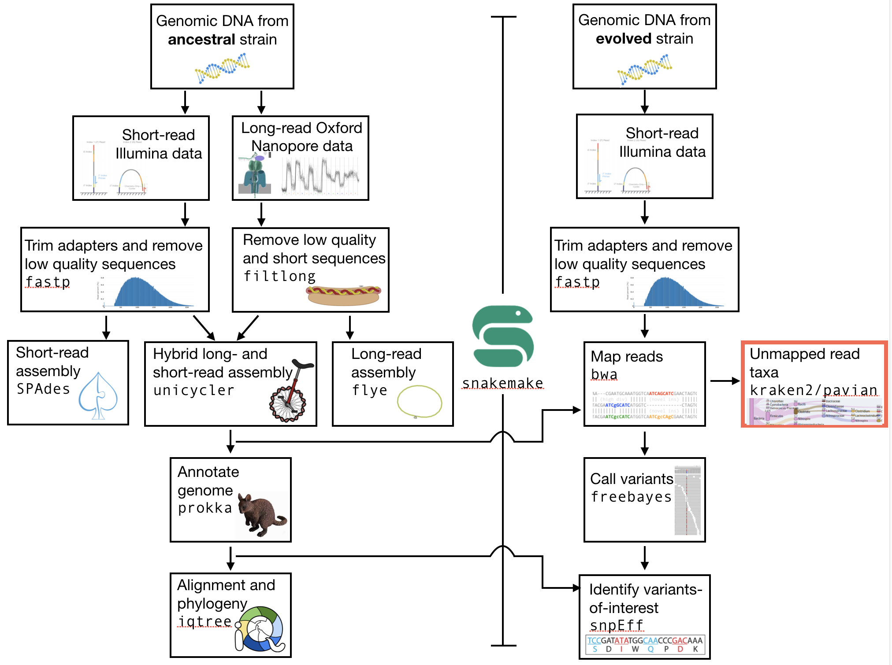
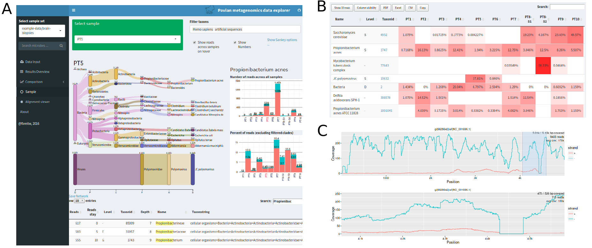

.. _taxonomic-investigation:

Taxonomic investigation
=======================

Preface
-------

We want to investigate if there are sequences of other species in our collection of sequenced DNA pieces.
We hope that most of them are from our species that we try to study, i.e. the DNA that we have extracted and amplified.
This might be a way of quality control, e.g. have the samples been contaminated (:numref:`fig-contaminant`)?
Lets investigate if we find sequences from other species in our sequence set.

.. _fig-contaminant:

   Gotta be careful.

We will use the tool |kraken| to assign taxonomic classifications to our sequence reads.
Let us see if we can id some sequences from other species.

.. NOTE::

   You will encounter some **To-do** sections at times. Write the solutions and answers into a text-file.

Overview
--------

The part of the workflow we will work on in this section can be viewed in :numref:`fig-workflow-taxa`.

.. _fig-workflow-taxa:

   The part of the workflow we will work on in this section marked in red.

Before we start
---------------

You should have a ``Snakefile`` for the other stepsof this workflow, including the previous step, read mapping. You will also have (minimally) two directories: your ``data`` diirectory (with subdirectories), and your ``results`` directory (perhaps woth subdirectories).

Today we will first do the steps *without* incorporating them into the ``Snakefile``. After you have completed the steps, you can incorporate them into the ``Snakefile``.

Kraken2
-------

We will be using a tool called |kraken| [WOOD2014]_.
This tool uses k-mers to assign a taxonomic labels in form of |ncbitax| to the sequence (if possible).
The taxonomic label is assigned based on similar k-mer content of the sequence in question to the k-mer content of reference genome sequence.
The result is a classification of the sequence in question to the most likely taxonomic label.
If the k-mer content is not similar to any genomic sequence in the database used, it will not assign any taxonomic label.

Installation
^^^^^^^^^^^^

Use conda in the same fashion as before to install |kraken|.
However, we are going to install kraken into its own environment:

.. code-block:: bash

   conda create --yes -n kraken kraken2 bracken
   conda activate kraken

Now we create a directory where we are going to do the analysis and we will change into that directory too.

.. code-block:: bash

   # make sure you are in your analysis root folder
   cd ~/genome_analysis

   # create a kraken directory
   # of course I leave this for you to do

Now we need to create or download or find a |kraken| database that can be used to assign the taxonomic labels to sequences.
Fortunately, there is one conveniently located on the server. It can be found here: ``/home2/gs/data/minikraken_v2``:

.. Todo::
   The "minikraken2" database was created from bacteria, viral and archaea sequences.
   What are the implications for us when we are trying to classify our sequences?

Usage
^^^^^

Now that we have installed |kraken| and downloaded and extracted the minikraken2 database, we can attempt to investigate the sequences we got back from the sequencing provider for other species as the one it should contain.
We call the |kraken| tool and specify the database and fasta-file with the sequences it should use. To investigate the general command structure simply type ``kraken2``:

.. code:: bash

   # see how kraken2 works and what the 
   # arguments are
   kraken2

   Need to specify input filenames!
    Usage: kraken2 [options] <filename(s)>

    Options:
      --db NAME               Name for Kraken 2 DB
                              (default: none)
      --threads NUM           Number of threads (default: 1)
      --quick                 Quick operation (use first hit or hits)
      --unclassified-out FILENAME
                              Print unclassified sequences to filename

Note that the input you are using is ``fastq``.
In addition, we are dealing with paired-end data, which we can tell |kraken| using the switch ``--paired``. Choose the **unmapped** read file that you have created as input for ``kraken2``. Also note that you should output a ``report`` file (use ``--report FILENAME``). Also note that the output of ``kraken2`` goes to the command line (standard out), so you should use the redirect to output to a text file. You can name this file something like ``myfile.kraken`` as it is not quite a normal text file, and this indicates that it is formatted for ``kraken2``.

The resulting content of your ``kraken2`` file should look similar to the following example:

.. include:: example-kraken.txt
   :literal:
   :end-line: 5

Each sequence classified by |kraken| results in a single line of output.
Output lines contain five tab-delimited fields; from left to right, they are:

1. ``C/U``: one letter code indicating that the sequence was either classified or unclassified.
2. The sequence ID, obtained from the FASTA/FASTQ header.
3. The taxonomy ID |kraken| used to label the sequence; this is **0** if the sequence
   is unclassified and otherwise should be the |ncbitax| identifier.
4. The length of the sequence in bp.
5. A space-delimited list indicating the lowest common ancestor (in the
   taxonomic tree) mapping of each k-mer in the sequence.
   For example, ``562:13 561:4 A:31 0:1 562:3`` would indicate that:

   * the first 13 k-mers mapped to taxonomy ID #562
   * the next 4 k-mers mapped to taxonomy ID #561
   * the next 31 k-mers contained an ambiguous nucleotide
   * the next k-mer was not in the database
   * the last 3 k-mers mapped to taxonomy ID #562

.. NOTE::
   The |kraken| manual can be accessed `here <https://www.ccb.jhu.edu/software/kraken2/index.shtml?t=manual>`__.

Investigate the taxa
^^^^^^^^^^^^^^^^

We can use the webpage `NCBI TaxIdentifier <https://www.ncbi.nlm.nih.gov/Taxonomy/TaxIdentifier/tax_identifier.cgi>`__ to quickly get the names to the taxonomy identifier.
However, this is impractical as we are dealing potentially with many sequences.
|kraken| has some scripts that help us understand our results better.

Because you (hopefully) used the |kraken| switch ``--report FILE``, you also have a sample-wide report of all taxa found.
This is much better to get an overview what was found.

The first few lines of an example report are shown below.

.. include:: example-kraken-report.txt
   :literal:
   :end-line: 10

The output of kraken-report is tab-delimited, with one line per taxon.
The fields of the output, from left-to-right, are as follows:

1. **Percentage** of reads covered by the clade rooted at this taxon
2. **Number of reads** covered by the clade rooted at this taxon
3. **Number of reads** assigned directly to this taxon
4. A rank code, indicating **(U)nclassified, (D)omain, (K)ingdom, (P)hylum, (C)lass, (O)rder, (F)amily, (G)enus, or (S)pecies**. All other ranks are simply **"-"**.
5. |ncbitax| ID
6. The indented scientific name

Bracken
^^^^^^^

|bracken| stands for Bayesian Re-estimation of Abundance with KrakEN, and is a statistical method that computes the abundance of species in DNA sequences from a metagenomics sample [LU2017]_. Crudely, this relies on the inferred frequencies of different taxa to gain confidence (or lose confidence) that other taxa are present or absent. For example, if there are 1,000 reads that match *E. coli* and only one that matches the closely related taxon *Shigella*, then the *Shigella* read might be assigned as belonging to *E. coli*.

Combined with the Kraken classifier, |bracken| will produces more accurate species- and genus-level abundance estimates than |kraken| alone.

The use of |bracken| subsequent to |kraken| is optional - but it might improve on the |kraken| results.

Installation
""""""""""""

We installed |bracken| already together with |kraken| above, so it should be ready to be used. 
We also downloaded the |bracken| files together with the minikraken2 database above, so we are good to go.

Usage
"""""

Now, we can use |bracken| on the |kraken| results to improve them.

The general structure of the |bracken| command look like this:

.. code:: bash

    # of course you can name the output file as you please
    bracken -d PATH_TO_DB_DIR -i kraken2.report -o bracken.species.txt -l S

- ``-l S``: denotes the level we want to look at. ``S`` stands for species - but other levels are available.
- ``-d PATH_TO_DB_DIR``: specifies the path to the |kraken| database that should be used.

Go ahead and apply |bracken| to your ``kraken2`` output file (not the ``report`` file):

The species-focused result-table looks similar to this:

.. include:: example-bracken.txt
   :literal:
   :end-line: 9

The important column is the ``new_est_reads``, which gives the newly estimated reads.

Visualisation (Pavian)
---------------------

We use the tool ``Pavian`` to create an interactive visualisation of the taxa content of our sample [ONDOV2011]_.
:numref:`fig-pavian` shows an example (albeit an artificial one) snapshot of the Pavian visualisation.

.. _fig-pavian:

   Example of a Pavian interactive report.

Fortunately for us, ``Pavian`` can run as an interactive web page, and can directly import ``kraken2`` and ``brakcen`` reports. This means that you will only have to ``rsync`` or ``scp`` the kraken (or ``bracken``) report than you have created onto your desktop, and from there you can access the `Pavian website <https://fbreitwieser.shinyapps.io/pavian/>`_. You can reach this by using the link, or by typing this link into your browser: ``https://fbreitwieser.shinyapps.io/pavian/``.

Once on the Pavian website, you should see the option to upload your ``kraken2`` report. Go ahead and do so. This willl result in an interactive report.

.. Attention::
   
   If you incorporate the ``kraken2`` analysis into your ``Snakefile`` then this will result in several ``kraken2`` reports being created. It is possible to download all of these and upload them simultaneously to the Pavian web server. In this way, you can see how the different samples might differ in their contaminants (or not).

.. only:: html

   .. rubric:: References

.. [KIM2017] Kim D, Song L, Breitwieser FP, Salzberg SL. Centrifuge: rapid and
             sensitive classification of metagenomic sequences. `Genome Res. 2016 Dec;26(12):1721-1729 <https://www.ncbi.nlm.nih.gov/pubmed/27852649>`__

.. [LU2017] Lu J, Breitwieser FP, Thielen P, Salzberg SL. Bracken: estimating species abundance in metagenomics data. `PeerJ Computer Science, 2017, 3:e104, doi:10.7717/peerj-cs.104 <https://peerj.com/articles/cs-104/>`__

.. [ONDOV2011] Ondov BD, Bergman NH, and Phillippy AM. Interactive metagenomic visualization in a Web browser. `BMC Bioinformatics, 2011, 12(1):385. <http://www.ncbi.nlm.nih.gov/pubmed/21961884>`__

.. [WOOD2014] Wood DE and Steven L Salzberg SL. Kraken: ultrafast metagenomic sequence classification using exact alignments. `Genome Biology, 2014, 15:R46. DOI: 10.1186/gb-2014-15-3-r46 <http://doi.org/10.1186/gb-2014-15-3-r46>`__.

