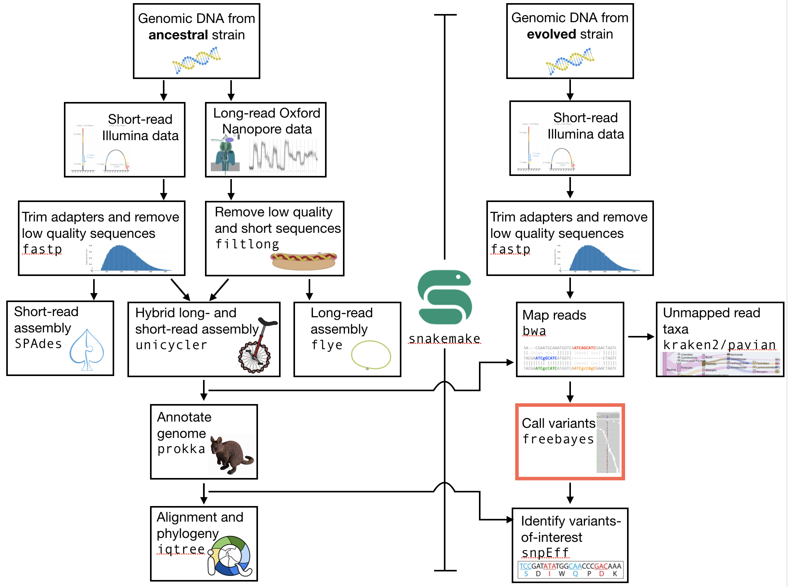
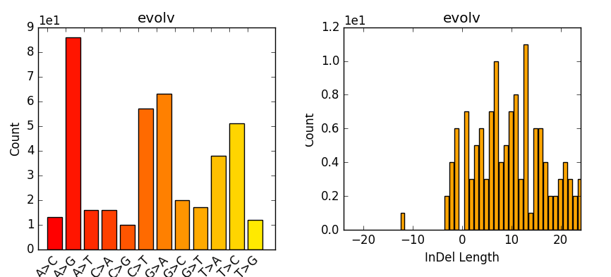

.. _ngs-variantcalling:

Variant calling
===============

Preface
-------

In this section we will use our genome assembly based on the ancestor and call genetic variants in the evolved line [NIELSEN2011]_. "Call variants" is the terminology we use when we are looking for mutations that have occurred when we compare the sequence from one clone (or individual) to another. A "variant" might be a single nucleotide substitution (e.g. T --> C), or it could be a deletion, a repeat expansions, etc. The aim in "variant calling" is to figure out how your sequence *differs* from the reference sequence that you have.

For humans, this is usually done to infer SNPs that exist between individuals. Here, we are doing it to find *mutations* that have occurred during experimental evolution. 

.. There is an accompanying lecture for this tutorial (`SNPs - GWAS - eQTLs introduction <http://dx.doi.org/10.6084/m9.figshare.1515026>`__).

.. NOTE`::

   You will encounter some **To-do** sections at times. Write the solutions and answers into a text-file.   

Overview
--------

The part of the workflow we will work on in this section can be viewed in :numref:`fig-workflow-var`.

.. _fig-workflow-var:

   The part of the workflow we will work on in this section marked in red.
   
     
Learning outcomes
-----------------

After studying this tutorial section you should be able to:

#. Use tools to call variants based on a reference genome.
#. Be able to describe what influences the calling of variants.

   
Installing the necessary software
-----------------------------
  
Tools we are going to use in this section and how to intall them if you not have done it yet.

.. code:: bash

          # activate the env
          conda activate ngs
          
          # Install these tools into the conda environment
          # if not already installed
          conda install samtools
          conda install bamtools
          conda install freebayes
          conda install bedtools
          conda install vcflib
          conda install rtg-tools
          conda install bcftools

          
Preprocessing
-------------

.. Attention::

    All the variant-calling that we will do *must* be done on the ``unicycler`` reference that you have assembled.

We first need to make an index of our reference genome as this is required by the SNP caller.
Given an assembly file in fasta-format, e.g. ``assembly.fasta`` which is located in the directory, use |samtools| to do this:

.. Attention::

    Remember to replace the file names and directory names below with the names that are relevant for your files (e.g. ``results/assembly.fasta`` may need to be replaced with the path to your specific assembly).

.. code:: bash
          
          samtools faidx results/assembly.fasta
   

Furthermore we need to pre-process our mapping files a bit further and create a bam-index file (``.bai``) for the bam-file we want to work with:

.. code:: bash
               
          bamtools index -in results/my_mapped_sorted_dedup_concordant.q20.bam

If you would like you can also create a new directory for the variants (e.g. ``variants``):

Calling variants
----------------

bcftools mpileup
~~~~~~~~~~~~~~~~

We use the sorted filtered bam-file that we produced in the mapping step before.

.. code:: bash

   # We first pile up all the reads and then call
   # variants using the pipe | operator
   bcftools mpileup -f results/assembly.fasta my_sorted_dedup_q20.bam | bcftools call -v -m -Ob -o my_variant_calls.bcf

This is a rather complicated instruction, which is partly due to 
the fact that there has been a very 
recent change from the tool used previously for this step, ``samtools mpileup``. 
With ``bcftools mpileup`` we use the pipe (``|``) operator
because we have no need ever for the intermediate output,
and instead feed the output of ``bcftools mpileup`` directly to ``bcftools call``. There are several options that we invoke, explained below:
   
|bcftools| mpileup parameter:

- ``-f FILE``: faidx indexed reference sequence file
  
|bcftools| call parameters:

- ``-v``: output variant sites only
- ``-m``: alternative model for multiallelic and rare-variant calling
- ``-o``: output file-name
- ``-Ob``: output type: binary compressed VCF

  
Freebayes
~~~~~~~~~

As an alternative we can do some variant calling with another tool called |freebayes|. In fact one reason to do so would be to compare the results of ``bcftools`` and ``freebayes``, and (for example) focus only on variant calls that are made by both tools.

Given a reference genome scaffold file in fasta-format, e.g. ``scaffolds.fasta`` and the index in ``.fai`` format and a mapping file (.bam file) and a mapping index (.bai file), we can call variants with |freebayes| like so:

.. code:: bash

   # Now we call variants and pipe the results into a new file
   freebayes -f assembly/results.fasta my_sorted_dedup_q20.bam > my_sorted_dedup_q20.vcf

         
Post-processing
---------------

Understanding the output files (.vcf)
~~~~~~~~~~~~~~~~~~~~~~~~~~~~~~~~~~~~~

Lets look at a vcf-file:

.. code:: bash

   # first 10 lines, which are part of the header
   # you know how to do this but I write
   # it out anyway
   head variants/evolved-6.mpileup.vcf

Lets look at the variants using ``less``:

.. code:: bash
               
   # you will need to scroll a little
   # after using less to get to the variant calls
   less variants/evolved-6.mpileup.vcf

          
.. code:: bash
          
    #CHROM  POS     ID      REF     ALT     QUAL    FILTER  INFO    FORMAT  H8_sorted.bam
    1       59501   .       C       A       228     .       DP=130;VDB=0.0235953;SGB=-0.693147;RPB=0.130017;MQB=3.91681e-08;MQSB=9.58804e-08;BQB=0.0391486;MQ0F=0.415385;AC=2;AN=2;DP4=39,0,29,27;MQ=16     GT:PL   1/1:255,17,0
    1       59593   .       A       C       228     .       DP=120;VDB=0.845548;SGB=-0.693147;RPB=0.612735;MQB=1.17223e-07;MQSB=8.69064e-05;BQB=0.00321345;MQ0F=0.525;AC=2;AN=2;DP4=39,7,27,24;MQ=12        GT:PL   1/1:255,11,0
    1       59614   .       A       G       228     .       DP=119;VDB=0.734093;SGB=-0.693147;RPB=0.902247;MQB=3.43515e-06;MQSB=0.0567731;BQB=0.0325125;MQ0F=0.537815;AC=2;AN=2;DP4=35,10,30,18;MQ=10       GT:PL   1/1:255,11,0

If you look carefully, you might notice that your variant calls are 
not spread evenly throughout the genome. This is because there are certain error-prone locations in your assembly. These are areas in which the assembly **is not correct** (or, is not likely to be correct), and in these places, many variants get called.
The fields in a vcf-file are described in he table (:numref:`table-vcf`) below:

.. _table-vcf:
.. table:: The vcf-file format fields.

   +-----+-----------+--------------------------------------------------------------------------------------+
   | Col | Field     | Description                                                                          |
   +=====+===========+======================================================================================+
   | 1   | CHROM     | Chromosome name                                                                      |
   +-----+-----------+--------------------------------------------------------------------------------------+
   | 2   | POS       | 1-based position. For an indel, this is the position preceding the indel.            |
   +-----+-----------+--------------------------------------------------------------------------------------+
   | 3   | ID        | Variant identifier. Usually the dbSNP rsID.                                          |
   +-----+-----------+--------------------------------------------------------------------------------------+
   | 4   | REF       | Reference sequence at POS involved in the variant. For a SNP, it is a single base.   |
   +-----+-----------+--------------------------------------------------------------------------------------+
   | 5   | ALT       | Comma delimited list of alternative seuqence(s).                                     |
   +-----+-----------+--------------------------------------------------------------------------------------+
   | 6   | QUAL      | Phred-scaled probability of all samples being homozygous reference.                  |
   +-----+-----------+--------------------------------------------------------------------------------------+
   | 7   | FILTER    | Semicolon delimited list of filters that the variant fails to pass.                  |
   +-----+-----------+--------------------------------------------------------------------------------------+
   | 8   | INFO      | Semicolon delimited list of variant information.                                     |
   +-----+-----------+--------------------------------------------------------------------------------------+
   | 9   | FORMAT    | Colon delimited list of the format of individual genotypes in the following fields.  |
   +-----+-----------+--------------------------------------------------------------------------------------+ 
   | 10+ | Sample(s) | Individual genotype information defined by FORMAT.                                   |
   +-----+-----------+--------------------------------------------------------------------------------------+

          
Statistics
~~~~~~~~~~

Now we can use it to do some statistics and filter our variant calls.

For example, we can get some quick stats with ``rtg vcfstats``:

.. code:: bash
               
   rtg vcfstats my_variant_calls_freebayes.vcf

   
Example output from ``rtg vcfstats``:

.. code::

   Location                     : variants/evolved-6.mpileup.vcf.gz
   Failed Filters               : 0
   Passed Filters               : 516
   SNPs                         : 399
   MNPs                         : 0
   Insertions                   : 104
   Deletions                    : 13
   Indels                       : 0
   Same as reference            : 0
   SNP Transitions/Transversions: 1.87 (286/153)
   Total Het/Hom ratio          : 3.20 (393/123)
   SNP Het/Hom ratio            : 8.98 (359/40)
   MNP Het/Hom ratio            : - (0/0)
   Insertion Het/Hom ratio      : 0.30 (24/80)
   Deletion Het/Hom ratio       : 3.33 (10/3)
   Indel Het/Hom ratio          : - (0/0)
   Insertion/Deletion ratio     : 8.00 (104/13)
   Indel/SNP+MNP ratio          : 0.29 (117/399)
   

   
However, we can also run |bcftools| to extract more detailed statistics about our variant calls:
   

.. code:: bash
               
   bcftools stats -F results/assembly.fasta -s - my_variant_calls_freebayes.vcf > my_variant_calls_freebayes.vcf.stats

- ``-s -``: list of samples for sample stats, "-" to include all samples
- ``-F FILE``: faidx indexed reference sequence file to determine INDEL context

  
Now we can take the stats and make some plots (e.g. :numref:`fig-vcfstats`) which are particular of interest if having multiple samples, as one can easily compare them. However, most of you are only working with one here:

.. code:: bash
   
   plot-vcfstats -p freebayes my_variant_calls_freebayes.vcf.stats

   
- ``-p``: The output files prefix, add a slash at the end to create a new directory.
   

.. _fig-vcfstats:

            
    Example of ``plot-vcfstats`` output.

Variant filtration
~~~~~~~~~~~~~~~~~~

Variant filtration is a big topic in itself [OLSEN2015]_.
There is no consens yet and research on how to best filter variants is ongoing. In addition (and rather surprisingly), the two methods that we have used to call variants, ``vcftools mpileup`` and ``freebayes`` differ considerably the quality scores that they assign. ``vcftools`` assigns a maximum of 228; ``freebayes`` has no maximum, and you will see that many scores are above 1000.

We will do some simple filtration procedures here.
For one, we can filter out low quality reads.

Here, we only include variants that have quality > 220.

.. code:: bash

   # use rtg vcffilter
   rtg vcffilter -Z -q 30 -i my_variant_calls.vcf -o my_variant_calls.q225.vcf

- ``-i FILE``: input file
- ``-o FILE``: output file
- ``-Z``: do not compress the output
- ``-q FLOAT``: minimal allowed quality in output.

Quick stats for the filtered variants:
  
.. code:: bash 
          
   # look at stats for filtered 
   rtg vcfstats my_variant_calls.q225.vcf

|freebayes| adds some extra information to the vcf-files it creates.
This allows for some more detailed filtering.
This strategy will *not* work on the |vcftools| mpileup called variants
Here we filter, based on some recommendation form the developer of |freebayes|:

.. code:: bash

   vcffilter -f "QUAL > 1 & QUAL / AO > 10 & SAF > 0 & SAR > 0 & RPR > 1 & RPL > 1" my_variant_calls_freebayes.vcf > my_variant_calls_freebayes.quality.vcf

- ``QUAL > 1``: removes really bad sites
- ``QUAL / AO > 10``: additional contribution of each obs should be 10 log units (~ Q10 per read)
- ``SAF > 0 & SAR > 0``: reads on both strands
- ``RPR > 1 & RPL > 1``: at least two reads “balanced” to each side of the site

   
.. todo::
    
   Look at the statistics. One ratio that is mentioned in the statistics is transition transversion ratio (*ts/tv*).
   Explain what this ratio is and why the observed ratio makes sense. 

This strategy used here will do for our purposes.
However, several more elaborate filtering strategies have been explored, e.g. `here <https://github.com/ekg/freebayes#observation-filters-and-qualities>`__.

.. only:: html

   .. rubric:: References

.. [NIELSEN2011] Nielsen R, Paul JS, Albrechtsen A, Song YS. Genotype and SNP calling from next-generation sequencing data. `Nat Rev Genetics, 2011, 12:433-451 <http://doi.org/10.1038/nrg2986>`__

.. [OLSEN2015] Olsen ND et al. Best practices for evaluating single nucleotide variant calling methods for microbial genomics. `Front. Genet., 2015, 6:235. <https://doi.org/10.3389/fgene.2015.00235>`__
