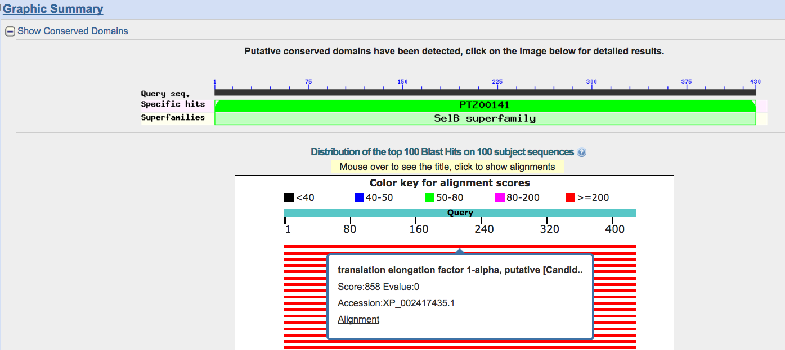

.. _ngs-voi:

Variants-of-interest
====================

Preface
-------

In this section we will use our genome annotation of our reference and our genome variants in the evolved line to find variants that are interesting in terms of the observed biology.

.. NOTE::

    You will encounter some **To-do** sections at times. Write the solutions and answers into a text-file.   

Overview
--------

The part of the workflow we will work on in this section can be viewed in :numref:`fig-workflow-voi`.

.. _fig-workflow-voi:
.. figure:: images/workflow.png
    
    The part of the workflow we will work on in this section marked in red.
   
     
Learning outcomes
-----------------

After studying this section of the tutorial you should be able to:

#. Identify variants of interests.
#. Understand how the variants might affect the observed biology in the evolved line.

  
General comments for identifying variants-of-interest
-----------------------------------------------------

Things to consider when looking for variants-of-interest:

- The quality score of the variant call.
  
  * Do we call the variant with a higher then normal score?
    
- The mapping quality score.
  
  * How confident are we that the reads were mapped at the position correctly?
    
- The location of the SNP.
  
  * Does the SNP overlap a coding region in the genome annotation?
    
- The type of SNP.

  * substitutions vs. indels (indels are common and often *wrong* for Nanopore assemblies).

Consider all of these factors and then construct some hypotheses about why you observe the change(s) you do (:numref:`fig-hypotheses`)

.. _fig-hypotheses:
.. figure:: images/hypotheses.png
    
    Your hypotheses.

SnpEff
------

We will be using |snpeff| to annotate our identified variants. The tool will tell us 
which mutations might warrant further analyses.

Installing software
~~~~~~~~~~~~~~~~~~~
  
Tools we are going to use in this section and how to install them if you not have done it yet.

.. code:: bash

    # activate the env
    conda activate ngs
          
    # Install these tools into the conda environment
    # if not already installed
    conda install snpeff
    conda install genometools-genometools
  

Make a directory if you like (e.g. before you integrate these steps into
your ``snakemake``), and change into
the directory:

.. code:: bash

    mkdir voi

    # change into the directory
    cd voi

         
Prepare the SnpEff database
~~~~~~~~~~~~~~~~~~~~~~~

We need to create our own config-file for |snpeff|. Where is the ``snpEff.config``:

.. code:: bash
    
    # look for snpEff.config in the miiniconda directory.
    # specify the /share/ subdirectory
    find ~/miniconda3/share/ -name snpEff.config
    # result should be something like
    # myhome/share/snpeff-5.0-1/snpEff.config
    

This will give you the path to the ``snpEff.config``. It might be looking a bit different then the one shown here, depending on the version of |snpeff| that is installed.

Make a local copy of the ``snpEff.config`` into your current directory
 (e.g. the results directory of your annotation) 
 and then edit it with an editor of your choice:

.. code:: bash

    # make sure this path is to *your* snpEff config
    # we are copying this so that the path is easy
    # to find and that we don't mess up the original
    cp myhome/share/snpeff-5.0-1/snpEff.config .
    nano snpEff.config

          
Make sure the data directory path in the ``snpEff.config`` looks like this:

.. code:: bash

    data.dir = ./data/

          
There is a section with databases, which starts like this (around line 130):

.. code:: bash

    #-------------------------------------------------------------------------------
    # Databases & Genomes
    #
    # One entry per genome version. 
    #
    # For genome version 'ZZZ' the entries look like
    #	ZZZ.genome              : Real name for ZZZ (e.g. 'Human')
    #	ZZZ.reference           : [Optional] Comma separated list of URL to site/s Where information for building ZZZ database was extracted.
    #	ZZZ.chrName.codonTable  : [Optional] Define codon table used for chromosome 'chrName' (Default: 'codon.Standard')
    #
    #-------------------------------------------------------------------------------

Add the following two lines in the database section underneath these header lines:

.. code:: bash

    # my E. coli genome
    ecolianc.genome : EcoliAnc

          
Now, we need to create a local data folder called ``./data/ecolianc``.

.. code:: bash

    # create folders
    # here -p makes the intermediate directories if needed
    mkdir -p ./data/ecolianc

Copy our genome assembly to the newly created data folder.
The name needs to be ``sequences.fa`` or ``ecolianc.fa`` (not
``assembly.fasta``):

.. code:: bash
    
    # for exxample
    cp assembly.fasta ./data/ecolianc/sequences.fa

    
Copy our genome annotation to the data folder.
The name needs to be ``genes.gff`` (or ``genes.gtf`` for gtf-files).

.. code:: bash

    cp my_prokka_annotation.gff ./data/ecolianc/genes.gff
    #gzip ./data/yeastanc/genes.gff

Now we can build a new |snpeff| database using the ``snpEff build`` command. We need to give
``snpEff`` the ``.gff`` file and the directory with the assembly. We will place the output of the command
into a file for later reference (``snpEff.stdout``).

.. code:: bash

    snpEff build -c snpEff.config -gff3 -v ecolianc > snpEff.stdout

SNP annotation
~~~~~~~~~~~~~~

Now we can use our new |snpeff| database to annotate some variants. To e.g.:

.. code:: bash

    snpEff -c snpEff.config ecolianc my_variant_calls.q225.vcf > my_variant_calls.q225.annotated.vcf

|snpeff| adds ``ANN`` fields to the vcf-file entries that explain the effect of the variant.

.. note::

   If you are unable to do the annotation, you can download an annotated vcf-file from :ref:`downloads`.

Example
~~~~~~~

Lets look at one entry from the original vcf-file and the annotated one.
We are only interested in the 8th column, which contains information regarding the variant.
|snpeff| will add fields here :

.. code:: bash

    # evolved-6.freebayes.filtered.vcf (the original), column 8
    AB=0.5;ABP=3.0103;AC=1;AF=0.5;AN=2;AO=56;CIGAR=1X;DP=112;DPB=112;DPRA=0;EPP=3.16541;EPPR=3.16541;GTI=0;LEN=1;MEANALT=1;MQM=42;MQMR=42;NS=1;NUMALT=1;ODDS=331.872;PAIRED=1;PAIREDR=1;PAO=0;PQA=0;PQR=0;PRO=0;QA=2128;QR=2154;RO=56;RPL=35;RPP=10.6105;RPPR=3.63072;RPR=21;RUN=1;SAF=30;SAP=3.63072;SAR=26;SRF=31;SRP=4.40625;SRR=25;TYPE=snp

    # evolved-6.freebayes.filtered.anno.vcf, column 8
    AB=0.5;ABP=3.0103;AC=1;AF=0.5;AN=2;AO=56;CIGAR=1X;DP=112;DPB=112;DPRA=0;EPP=3.16541;EPPR=3.16541;GTI=0;LEN=1;MEANALT=1;MQM=42;MQMR=42;NS=1;NUMALT=1;ODDS=331.872;PAIRED=1;PAIREDR=1;PAO=0;PQA=0;PQR=0;PRO=0;QA=2128;QR=2154;RO=56;RPL=35;RPP=10.6105;RPPR=3.63072;RPR=21;RUN=1;SAF=30;SAP=3.63072;SAR=26;SRF=31;SRP=4.40625;SRR=25;TYPE=snp;ANN=T|missense_variant|MODERATE|CDS_NODE_40_length_1292_cov_29.5267_1_1292|GENE_CDS_NODE_40_length_1292_cov_29.5267_1_1292|transcript|TRANSCRIPT_CDS_NODE_40_length_1292_cov_29.5267_1_1292|protein_coding|1/1|c.664T>A|p.Ser222Thr|664/1292|664/1292|222/429||WARNING_TRANSCRIPT_INCOMPLETE,T|intragenic_variant|MODIFIER|GENE_NODE_40_length_1292_cov_29.5267_1_1292|GENE_NODE_40_length_1292_cov_29.5267_1_1292|gene_variant|GENE_NODE_40_length_1292_cov_29.5267_1_1292|||n.629A>T||||||  

When expecting the second entry, we find that |snpeff| added annotation information starting with ``ANN=T|missense_variant|...``.
If we look a bit more closely we find that the variant results in a amino acid change from a threonine to a serine (``c.664T>A|p.Ser222Thr``).
The codon for serine is ``TCN`` and for threonine is ``ACN``, so the variant in the first nucleotide of the codon made the amino acid change.

A quick protein |blast| of the CDS sequence where the variant was found.

.. _fig-blast-voi:

    
    Results of a |blast| search of the CDS.
