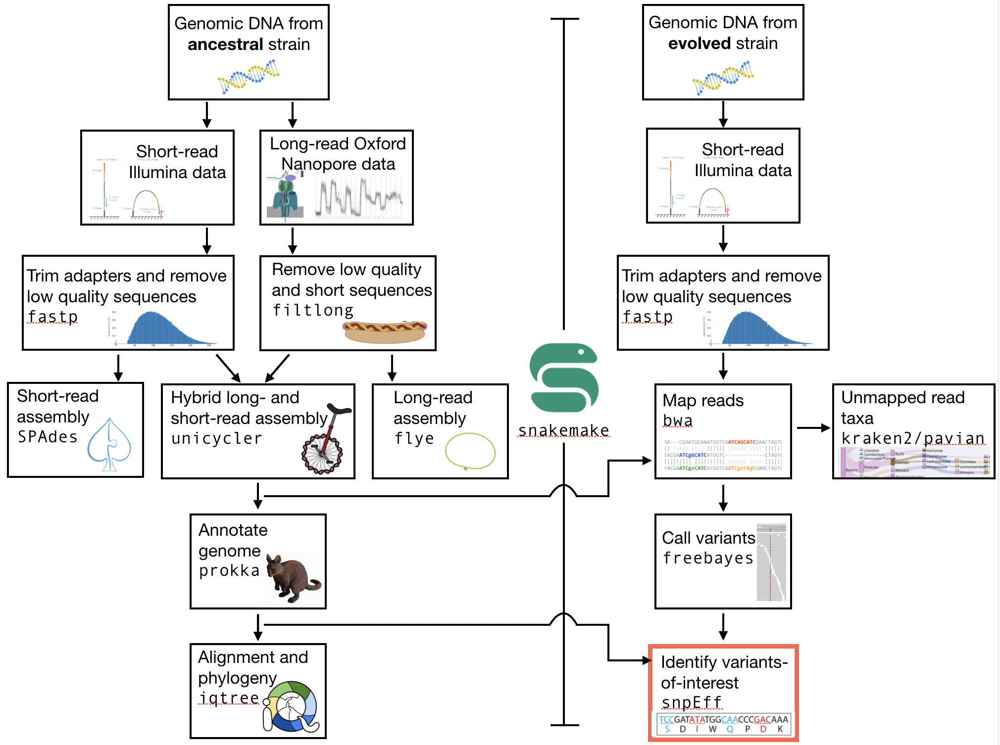

.. _ngs-voi:

Variants-of-interest
====================

Preface
-------

In this section we will use our genome annotation of our reference and our genome variants in the evolved line to find variants that are interesting in terms of the observed biology.

.. NOTE::

    You will encounter some **To-do** sections at times. Write the solutions and answers into a text-file.   

Overview
--------

The part of the workflow we will work on in this section can be viewed in :numref:`fig-workflow-voi`.

.. _fig-workflow-voi:

    
    The part of the workflow we will work on in this section marked in red.
   
     
Learning outcomes
-----------------

After studying this section of the tutorial you should be able to:

#. Identify variants of interests.
#. Understand how the variants might affect the observed biology in the evolved line.

  
General comments for identifying variants-of-interest
-----------------------------------------------------

Things to consider when looking for variants-of-interest:

- The quality score of the variant call.
  
  * Do we call the variant with a higher then normal score?
    
- The mapping quality score.
  
  * How confident are we that the reads were mapped at the position correctly?
    
- The location of the SNP.
  
  * Does the SNP overlap a coding region in the genome annotation?
    
- The type of SNP.

  * substitutions vs. indels (indels are common and often *wrong* for Nanopore assemblies).

Consider all of these factors and then construct some hypotheses about why you observe the change(s) you do (:numref:`fig-hypotheses`)

.. _fig-hypotheses:
.. figure:: images/hypotheses.png
    
    Your hypotheses.

SnpEff
------

We will be using |snpeff| to annotate our identified variants. The tool will tell us 
which mutations might warrant further analyses.

Installing software
~~~~~~~~~~~~~~~~~~~
  
Tools we are going to use in this section and how to install them if you not have done it yet.

.. code:: bash

    # activate the env
    conda activate ngs
          
    # Install these tools into the conda environment
    # if not already installed
    conda install snpeff
    install -c bioconda snpsift
    conda install genometools-genometools
  

Make a directory if you like (e.g. before you integrate these steps into
your ``snakemake``), and change into
the directory:

.. code:: bash

    mkdir voi

    # change into the directory
    cd voi

         
Prepare the SnpEff database
~~~~~~~~~~~~~~~~~~~~~~~

We need to create our own config-file for |snpeff|. Where is the ``snpEff.config``:

.. code:: bash
    
    # look for snpEff.config in the miiniconda directory.
    # specify the /share/ subdirectory
    find ~/miniconda3/share/ -name snpEff.config
    # result should be something like
    # myhome/share/snpeff-5.0-1/snpEff.config
    

This will give you the path to the ``snpEff.config``. It might be looking a bit different then the one shown here, depending on the version of |snpeff| that is installed.

Make a local copy of the ``snpEff.config`` into your current directory
 (e.g. the results directory of your annotation) 
 and then edit it with an editor of your choice:

.. code:: bash

    # make sure this path is to *your* snpEff config
    # we are copying this so that the path is easy
    # to find and that we don't mess up the original
    cp myhome/share/snpeff-5.0-1/snpEff.config .
    nano snpEff.config

          
Make sure the data directory path in the ``snpEff.config`` looks like this (most
 likely it does):

.. code:: bash

    data.dir = ./data/

          
There is a section with databases, which starts like this (around line 130):

.. code:: bash

    #-------------------------------------------------------------------------------
    # Databases & Genomes
    #
    # One entry per genome version. 
    #
    # For genome version 'ZZZ' the entries look like
    #	ZZZ.genome              : Real name for ZZZ (e.g. 'Human')
    #	ZZZ.reference           : [Optional] Comma separated list of URL to site/s Where information for building ZZZ database was extracted.
    #	ZZZ.chrName.codonTable  : [Optional] Define codon table used for chromosome 'chrName' (Default: 'codon.Standard')
    #
    #-------------------------------------------------------------------------------

Add the following two lines in the database section underneath these header lines:

.. code:: bash

    # my E. coli genome
    ecolianc.genome : EcoliAnc

          
And go ahead and save and close the ``snpEff.config`` file.

Now, we need to create a local data folder called ``./data/ecolianc`` (e.g. 
in your ``voi`` directory).

.. code:: bash

    # create folders
    # here -p makes the intermediate directories if needed
    mkdir -p ./data/ecolianc

Copy our genome assembly to the newly created data folder.
The name needs to be ``sequences.fa`` or ``ecolianc.fa`` (not
``assembly.fasta``). Again here we copy so that it is present in 
the ``./data/ecolianc`` directory.

.. code:: bash
    
    # for exxample
    cp assembly.fasta ./data/ecolianc/sequences.fa

    
Lastly, copy your genome annotation to the data folder.
The name needs to be ``genes.gff`` (or ``genes.gtf`` for gtf-files), 
and should be a result of your ``prokka`` analysis.

.. code:: bash

    cp my_prokka_annotation.gff ./data/ecolianc/genes.gff
    #gzip ./data/yeastanc/genes.gff

Now you can build a new |snpeff| database using the ``snpEff build`` command. We need to give
``snpEff`` the ``.gff`` file and the directory with the assembly. We will place the output of the command
into a file for later reference (``snpEff.stdout``). This should take only a few seconds.

.. code:: bash

    snpEff build -c snpEff.config -gff3 -v ecolianc > snpEff.stdout

SNP annotation
~~~~~~~~~~~~~~

Now we can use our new |snpeff| database to annotate some variants. To do this we
invoke the ``snpEff`` command, tell it the folder that contains the reference, gff, and
a newly created snpEff predictor file, and lastly, give it the current ``.vcf`` file. Important:
 use the ``ud 0`` argument to prevent annotation of possible effects on upstream and downstream genes.
  This means that it will look 0 bp upstream and 0 bp downstream for effects.
For example:

.. code:: bash

    snpEff -ud 0 -c snpEff.config ecolianc my_variant_calls.q220.vcf > my_variant_calls.q220.annotated.vcf

|snpeff| adds ``ANN`` fields to the vcf-file entries that explain the effect of the variant.
You should annotate both your ``bamtools`` and ``freebayes`` ``.vcf`` fiiles.

Example
~~~~~~~

Lets look at one entry from the annotated one.
We are only interested in the 8th column, which contains information regarding the variant.
|snpeff| will add fields here:

.. code:: bash

    # my_variant_calls.q225.annotated.vcf
    1   3593830 .   C   T   563.058 .   AB=0;ABP=0;AC=2;AF=1;AN=2;AO=26;CIGAR=1X;DP=27;DPB=27;DPRA=0;EPP=19.3799;EPPR=0;GTI=0;LEN=1;MEANALT=2;MQM=31.0769;MQMR=0;NS=1;NUMALT=1;ODDS=40.6488;PAIRED=1;PAIREDR=0;PAO=0;PQA=0;PQR=0;PRO=0;QA=862;QR=0;RO=0;RPL=5;RPP=24.391;RPPR=0;RPR=21;RUN=1;SAF=21;SAP=24.391;SAR=5;SRF=0;SRP=0;SRR=0;TYPE=snp;ANN=T|missense_variant|MODERATE|HCBPOPCK_03471|GENE_HCBPOPCK_03471|transcript|TRANSCRIPT_HCBPOPCK_03471|protein_coding|1/1|c.970G>A|p.Ala324Thr|970/3498|970/3498|324/1165||,T|intragenic_variant|MODIFIER|HCBPOPCK_00086|null|gene_variant|null|||n.3593830C>T||||||   GT:DP:RO:QR:AO:QA:GL    1/1:27:0:0:26:862:-64.7878,-7.82678,0

Wow.

|snpeff| added annotation information starting with ``ANN=T|missense_variant|...``.
If we look a bit more closely we find that the variant results in a amino acid change 
from an alanine to a threonine (``Ala324Thr``). In addition, snpEff views this as a
 change with a ``MODERATE`` effect, and tells you that it occurred in the 
 gene ``HCBPOPCK_03471``.

False positives
~~~~~~~

There are frequently false positive variants identified when dealing with 
hybrid assemblies (like ``unicycler``). In our experience, we find those are 
often indels. For this reason, it might be useful to screen out variants that 
are indels, or to select *only* variants that are SNPs (e.g. mutations from C to T). 
Using the command line program ``grep``, it is simple to identify those variants, for example:

.. code:: bash
    # grep finds lines in a file that match specific pattern of text
    # here we look for lines that match "TYPE=snp"
    # note that "TYPE=snp" is only a field present in your freebayes variant calls
    # the syntax of grep is "grep mypattern myfile.txt"
    grep 'TYPE=snp' my_variant_calls.q220.annotated.vcf

You could also look for variants that satisfy two conditions, for example, that
are both SNPs AND which cause missense mutations (rather than synonymous mutations):

.. code:: bash
    # here we look for lines that match "TYPE=snp" AND
    # "missense_variant"
    # the .* in the middle acts as a wildcard
    grep 'TYPE=snp.*missense_variant' my_variant_calls.q220.annotated.vcf

In both cases above you can redirect the output to a file using ``>``.

From variants-of-interest to genes-of-interest
~~~~~~~
Unfortunately, snpEff, while it gives you a lot of information on the type, 
effect, and effect size of your mutation,
it does *not* give you a nice name for the gene in which the mutation occurred 
(see above, ``HCBPOPCK_03471``). To find the name, you
can either turn to your genome browser (IGV, see the Genome annotation section), or you can 
look at the ``.tsv`` file produced by ``prokka``.

Again, here we can exploit ``grep`` to find the gene in which the variant-of-interest has
 occurred. For example, if you are interested in ``HCBPOPCK_03471``, you can find the 
 gene using ``grep HCBPOPCK_03471 my_prokka_annotation.tsv``. This should give you a line
 similar to the following:

.. code:: bash
    # here we are unlucky and find only a hypothetical protein
    grep HCBPOPCK_03471 my_prokka_annotation.tsv
     > HCBPOPCK_03471  CDS hypothetical protein

     # let's try something else
     grep HCBPOPCK_00056 PROKKA_04222021.tsv
     HCBPOPCK_00056 CDS era_1   GTPase Era

In this way,  you can select variants that appear in genes that might 
look to be of interest. For example, you can now ask what IcsA *does* in
*E. coli*. One good place to begin is the `EcoCyc website <https://ecocyc.org/>`_.
 Try going there and searchiing for your gene (e.g. `era <https://ecocyc.org/gene?orgid=ECOLI&id=EG10270>`_) .

